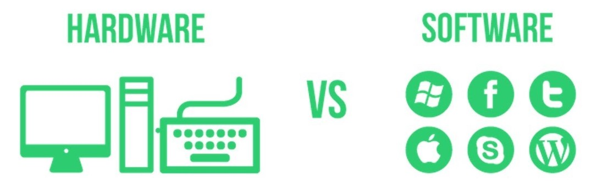

# Basic Computer Terminology

Computers are made of both hardware and software.

 

### **Hardware vs. software**

<a href="https://www.youtube.com/watch?v=NARrnGza4kA"><em>Professor Adam Morgan Hardware vs Software</em></a>

> **Hardware** refers to the **physical structure** of the computer. 
>
> *Basically the stuff you can touch.*

Some examples are the hard drive, central processing unit, hardrive, USB ports, etc.

> **Software** is any **set of instructions** that tells the hardware **what to do** and **how to do it**.
>
> The stuff you cannot touch.

This includes things like the operating system and applications like Google Chrome and Microsoft Word.

  

## Basic Computer Parts

We'll be making lots of references to computer parts so let's briefly go over the most important ones:

- **CPU** or Central Processing Unit
- **RAM** or Random Access Memory
- **Hard-drive** or Storage Disc

 

### CPU

 

The CPU (Central Processing Unit), also called the processor has the role of **executing instructions of a software program**.

The "power" of a CPU is determined by how many instructions it can execute per second, which is usually measure in **gigahertz GHz**  (billions of instructions per second).

Most modern CPU have multiple cores, which means you can multiply it's speed by the number of cores to get the "overall speed".

 

### RAM

 The RAM (Random Access Memory), is used to **temporarily hold information** while the CPU is processing it.

The CPU does not access information directly form the Hard drive because the Hard drive is very slow compared to the CPU (it would have to wait too long). Therefore the RAM temporarily loads data and instructions and passes it to the CPU.

RAM is measured in gigabytes (GB). **The more RAM you have, the more programs you can have open at the same time**.

However, once the computer is **powered off, all information is erased from the RAM**.

 

### Storage Discs

<a href="#"><em>Hard Drive without the cover showing spinning disc</em></a>

 

The Storage Disc or Storage Drive, is where your software, documents, movies, and other files are stored. The Storage Drive is **long-term storage**, which means the data is still saved even if you turn the computer off or unplug it.

When you run a program or open a file, the computer copies some of the data from the **storage disc** onto the **RAM**. When you **save** a file, the data is copied back to the drive.

A **Hard Drive** is an older type of storage drives that uses a spinning disc (like a spinning vinyl) store information. Modern drives use a technology called **SSD or Solid State Drives**, which has no moving parts and are much faster than spinning discs. SSD's allow your computer to **start up and load programs faster.**

<a href="#"><em>Solid State Drive with and without cover</em></a>

 

The storage space of a hard drive is measure in gigabytes (GB), which is the same unit used to measure the RAM. Some discs can store more than 1,000x GB which is the equivalent of a Terabyte (TB).

 

Other forms of storage discs include:

- USB Keys
- SD Cards
- DVDs or Blue-Ray discs

 

### Computer as a System

Together the parts above form a system. Look at them as the **resources available** for your computer system to get things done.

 

### Computer-Desk Analogy

Image that your computer is an office desk where you get work done.

Let's compare the CPU, RAM and the Hard drive to things in that desk.

 

 

**The Hard drive would be the book shelf** where we store lots of information but it takes some time to get up from our desks and retrieve the book.

**The CPU would be the calculator and your fingers.** The calculator can perform advanced mathematical operations extremely fast. The speed only depends on how fast your fingers can punch numbers.

**The RAM would be the physical desk surface**. The larger the desk surface area, the more open books you can have in order to look up information and add it to the calculator. If the desk is really small, you have to close the book that is currently open, put it in the shelf and pick up a new book every time you need to lookup new information.

 

## Finding Computer Specs (in Windows)

To find out how many resources we have, let's look at the specifications for our computers.

There are many ways to find this information. Some of the simplest ones are:

### Processor & RAM

1. Open the File Explorer

   - ( by typing "File Explorer" in the Windows Start Menu ) 

2. Right click on the "This PC" icon

3. Select "Properties"

4. Note the processor type and amount of RAM

   

### Storage Space

For the amount of long-term storage space (assuming you only have one storage disk):

1. Open the File Explorer
2. Right click on the "Local Disk (C:)" icon
3. Select "Properties"
4. Note the capacity of your disk

 

## Finding Specs (on MacOS)

According to the [Apple's official documentation](https://support.apple.com/en-us/HT203001):

1. Choose Apple menu  > About This Mac.

This opens an overview of your  Mac, including your:

- Mac model,
- processor,
- memory,
- serial number,
- [version of macOS](https://support.apple.com/kb/HT201260). 

 

## Shopping for a Computer

Have you ever shopped for a computer?

If so, what were your criteria? What were you looking for when shopping?

> Normally, the first thing we need to determine is the types of tasks that we will be performing with the computer.

Here are some questions you can ask yourself:

1. What kind of computer have I been using lately? What are it's specs?

- ​	What about this computer is limiting me?

  - Speed? Storage space? The amount of programs I have open?

    

2. Will I be storing a lot of data in this computer?

- Files like movies and pictures than take a lot of storage space
  - Do I need to have all these files in my computer or can I move them to a external disk?

3. Will I be using "heavy" programs on the computer? (programs that use a lot of CPU)

- Microsoft Word and Internet browsing are light weight programs
- Gaming and video editing are heavy programs

4. Is speed very important for me?

- Hard drives are still very common but if speed is very important you can consider an SSD drive.
- If speed is important, look at the speed of the CPU and how many cores it has.