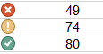

# Conditional Formatting

**Conditional formatting** provides a way to visualize data and make worksheets easier to understand.

Let's watch this [video](https://www.youtube.com/watch?time_continue=69&v=zfQ8uOBoIj8&feature=emb_logo) for a quick demo.

#### To create a conditional formatting rule:

1.  From the **Home** tab, click the **Conditional Formatting** command.
    
2.  Hover the mouse over the desired **conditional formatting type** and select the **desired rule** from the menu that appears.
    
3.  In the dialog box, enter the **desired value(s)**.
    
4.  Select an existing formatting style from the drop-down menu or set a custom format.
    

##### Conditional formatting presets

Excel has three **presets** you can use to quickly apply conditional formatting to your data.

1.  **Data Bars**: Horizontal bars added to each cell, like a **bar graph**.
    
2.  **Color Scales**: Changes the color of each cell based on its value.
    
    -   For example, in the **Green-Yellow-Red** color scale, the **highest** values are green, the **average** values are yellow, and the **lowest** values are red.
        
3.  **Icon Sets** add a specific icon to each cell based on its value.
    

To use presets:

1.  From the **Home** tab, click the **Conditional Formatting** command.
    
2.  Hover the mouse over the **desired preset (Data Bars, Color Scales, or Icon Sets)**, then choose a **preset style** from the menu that appears.
    

### Removing conditional formatting

1.  Click the **Conditional Formatting** command. A drop-down menu will appear.
    
2.  Hover the mouse over **Clear Rules**, then choose which rules you want to clear.
    

Alternatively, Click on **Manage Rules** to edit or delete **individual** rules. This is useful if you have **multiple rules**.

### **References**

-   [Conditional Formatting](https://edu.gcfglobal.org/en/excel/conditional-formatting/1/)
    

### **Exercises**

1.  Please go to this [link](https://edu.gcfglobal.org/en/excel/conditional-formatting/1/) and complete the challenge.
    
2.  On the same sheet change the icon set rules to display the following:
    
    -   ❌ for grades below 50.
        
    -   ❕ for grades greater than or equal to 50 and below 80.
        
    -   ✔ for grades greater than or equal to 80.
        

3.  Make it so the grades that define the icon-set rules can be changed as cell values ?

