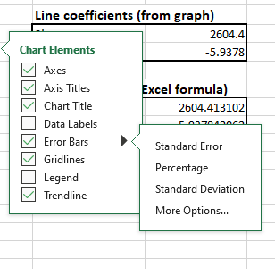
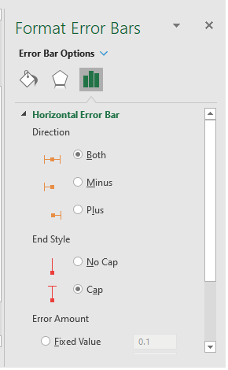

# Error bars

-   Error bars in charts display margins of error and standard deviations.
    
-   They can be shown on all data points in a series as a **standard error amount,** **a percentage**, or **a standard deviation**.
    
-   Error bars can be added in 2-D area, bar, column, line, xy (scatter), and bubble charts. In scatter and bubble charts, you can show error bars for x and y values.
    

To add or remove error bars:

1.  Click anywhere in the chart.
    
2.  Click the **Chart Elements** button + next to the chart, and then check the **Error Bars** box.
    
3.  To change the error amount shown, click the arrow next to **Error Bars**, and then pick an option.
    
    
    
    -   **Standard Error**
        
    -   **Percentage**
        
    -   **Standard Deviation**
        
    -   **More Options**
        
        -   To set your own error bar amounts, change the direction, end style of the error bars, or create custom error bars.
            
            s
            

**Exercises**

Download the excel sheet `errorbars.xlsx` from lea

Using the **tablet characterization** sheet.

1.  Write the proper formulas in the light blue cells to calculate the std of weight and thickness values of the tablets.
    
2.  Create a Scatter Chart with Straight lines and markers of tablet number vs Weight
    
3.  Add a custom error bar with the std value.
    
4.  Click on the horizontal error bars and press on the del key to remove them.
    
5.  Create a Scatter Chart with Straight lines and markers of tablet number vs Thickness
    
6.  Add a custom error bar with the std value.
    
7.  Click on the horizontal error bars and press on the del key to remove them.
    

Using the **grades** sheet.

1.  Write the proper formulas in the light blue cells to calculate the average and std values of each assignment.
    
2.  Create a 2D column chart with the average values of each assignment.
    
3.  Using select data command add the assignment 1 series to the chart.
    
4.  Using select data command add the assignment 2 series to the chart.
    
5.  Change the chart type of the assignment 1 and 2 to scatter.
    
6.  Select the assignment 1 series and click on select data. Since we modified the chart type of the series we can now edit the series and select x values. Select x values to be equal to 1.
    
7.  Select the assignment 2 series and click on select data. Since we modified the chart type of the series we can now edit the series and select x values. Select x values to be equal to 2.
    
8.  Add a custom error bar with the std value on the averages series.