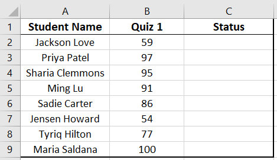
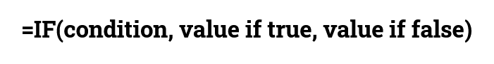
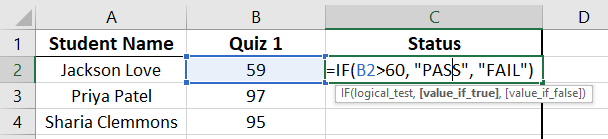
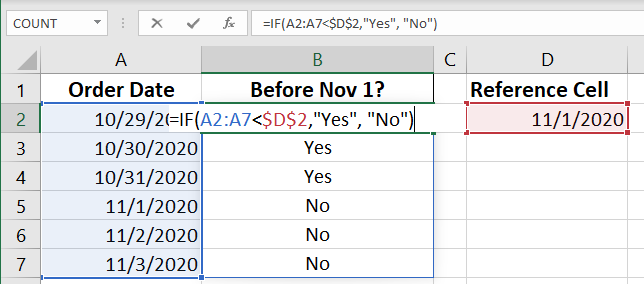
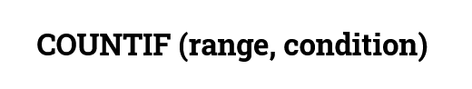
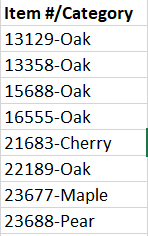
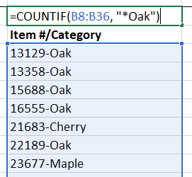

# If and Count in Excel

In some cases, it is desirable to manipulate data only if the data meets certain criteria.


## IF Function

For example, for a list of student's grades, you might want to output the word "PASS" or "FAIL", depending on the grade for a class.




To do this, we can use the **=IF function** in excel

> The **IF function** checks whether a condition is met. It returns one value if the condition is met (TRUE) and another value if the condition is not met (FALSE).

The specific syntax (order or the parameters and conditions) is as follow:





**Condition**: the criteria that we are checking. It must result in true or false.

**Value if true:** the new value of the cell if the **condition** is true.

- If this value is a text, it must be wrapped in double quotes ""

**Value if false:** the new value of the cell if the **condition** is false.

- If this value is a text, it must be wrapped in double quotes ""

<br>

In the school grades example above, if the pass or fail grade was 60, we would use the following command in the first cell of the "Status" column:




The condition is that the value inside cell B2 is greater than 60.


## Comparison Operators

There are a few comparison operators:

| Operator | Description   |
| -------- | ------------- |
| <        | less than     |
| >        | more than     |
| =        | equals to     |
| <>       | not equals to |


### Possible things to compare

When using the operators above, it's possible to compare:

- Text

  - Must wrap text with double quotes (eg. *“Sold”*)

- Numbers

- Dates

  - Must refer to a cell containing the date. You cannot add the data in the `=IF( )` formula.

    


## COUNTIF & SUMIF formulas

The **COUNTIF** and **SUMIF formulas** are similar to **IF**. They will count and sum if a specific condition is met.





In the SUMIF formula you can specify a range to be summed that is different from the range to be compared against the condition.

<br>

> For `COUNTIF` and `SUMIF` **you must wrap the operator and the value with double quotes**


Using a date in the condition:

```
=COUNTIF(A1:A34, "<11/01/2020")
```


### Wild Card

Sometimes our condition is that a cell contains a keyword.

For example, consider the following data from a store's inventory:




If we wanted to count how many items match the keyword "Oak", the normal `COUNTIF` condition would not work. The text value of the cell changes every time.

> The * symbol (asterisk) can be used as a wild card to assume any value.
>
> It works as a "joker" or "fill in the blank"

To match any cell containing the text "Oak" we can perform the following `COUNTIF`:



## Exercises

Please download the `if_count.xlsx` file from lea.

1. In sheet `grades`, add an if function that displays Pass if the grade is >=60 and fail oetherwise.
2. In sheet `t-shirts`, write the functions in cells H3, H4, H5, and H6 that counts how many orders have the 4 different sizes in them. 

3. In sheet `t-shirts`, write the functions in cells H11-H17 that counts how many orders have been payed or have a problem with payment.
4. In sheet `Trees_Inventory`, write the proper functions in cells I7, I8, I9, and I10 to display the counts or values based on the required conditions.

