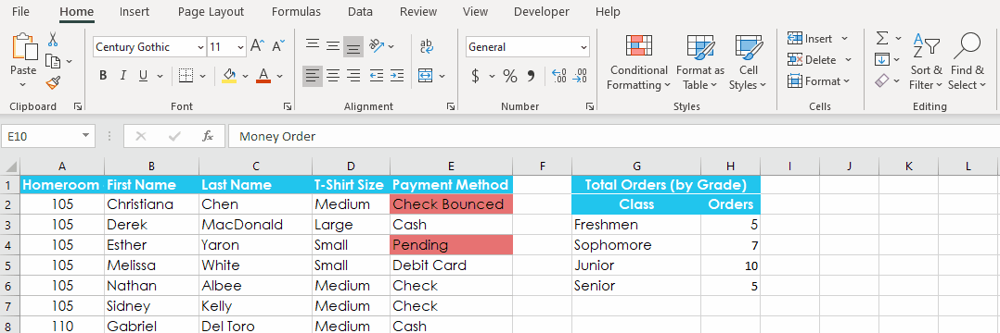

# Replacing, Sorting & Filtering

## Find and Replace

When working with a lot of data in Excel, to find and/or replace specific information the **Find** feature can be used.

#### To find Content:

1.  From the **Home** tab, select the **Find and Select** command, then select **Find** from the drop-down menu.
    
    > You can also access the Find command by pressing **Ctrl+F** on your keyboard.
    
2.  Enter the **content** you want to find.
    
3.  Select **Find Next**. If the content is found, the cell containing that content will be **selected**.
    
4.  To find more instances select **Find Next** again or **Find All** to see every instance of the search term.
    

#### To replace cell content:

1.  From the **Home** tab, select the **Find & Select** command, then select **Replace** from the drop-down menu.
    
2.  Type the text you want to find in the **Find what** field.
    
3.  Type the text you want to replace it with in the **Replace with** field, then click **Find Next**.
    
4.  If the content is found, the cell containing this content will be **selected**.
    
5.  If you want to replace it, you can choose to:
    
    -   **Replace** will replace individual instances,
        
    -   **Replace All** will replace every instance of the text throughout the workbook.
        
        > **Replace All** doesn't give you the option reviewing before replacing.
        

## Freezing Panes and View Options

When you're working with a lot of data, excel makes it possible to view data from different parts of your workbook with the **freeze** **panes** and **split** features.

> Let's watch this [video](https://www.youtube.com/watch?time_continue=257&v=zuhsUNBeNHw&feature=emb_logo) for a quick demo.

#### To freeze the top row (row 1) or first column (column A):

1.  Go to the **View** tab, select the **Freeze Panes** command, then choose **Freeze Top Row** or **Freeze First Column** from the drop-down menu.
    

#### To freeze rows:

1.  Select the **row** below the row(s) you want to **freeze**.
    
2.  Go to the **View** tab, select the **Freeze Panes** command, then choose **Freeze Panes** from the drop-down menu.
    

#### To freeze columns:

1.  Select the **column** to the right of the column(s) you want to **freeze**.
    
2.  Go to the **View** tab, select the **Freeze Panes** command, then choose **Freeze Panes** from the drop-down menu.
    

#### To unfreeze panes:

1.  Go to the **View** tab, select the **Freeze Panes** command, then choose **UnFreeze Panes** from the drop-down menu.
    

#### To open a new window for the current workbook:

1.  Go to the **View** tab on the **Ribbon**, then select the **New** **Window** command.
    
    > If you have several windows open at the same time, you can use the **Arrange All** command to rearrange them quickly.
    

#### To split a worksheet:

1.  Select the **cell** where you want to split the worksheet. In our example, we'll select cell **D6**.
    
2.  Go to the **View** tab on the **Ribbon**, then select the **Split** command.
    
3.  After creating a split, you can click and drag the vertical and horizontal dividers to change the size of each section or cancel a section.
    

## Sorting and Filtering

You can organize your data in Excel by sorting it.

You can sort data alphabetically, numerically, by date, or a custom order you set.

You can from the **home** tab from the **sort & filter** dropdown menu or use the commands in the **data** tab.

> Let's watch this [video](https://www.youtube.com/watch?v=Ep5q1cUhQas&t=260s) for a quick demo.

#### Types of sorting:

When sorting data, it's important to first decide if you want the sort to apply to the **entire worksheet** or just a **cell range**.

1.  **Sort sheet** organizes all of the data in your worksheet by one column. Related information across each row is kept together when the sort is applied.
    
2.  **Sort range** sorts the data in a range of cells, which is useful when a sheet contains several tables. Sorting a range will not affect other content in the worksheet.
    

#### To sort a sheet:

1.  Select a **cell** in the column you want to sort.
    
2.  Select the **Data** tab on the **Ribbon**, then click the **A-Z command** to sort A to Z, or the **Z-A command** to sort Z to A
    

#### To sort a range:

1.  Select the **cell range** you want to sort.
    
2.  Select the **Data** tab on the **Ribbon**, then click the **Sort** command.
    
3.  The **Sort** dialog box will appear. Choose the **column** you want to sort.
    
4.  Decide the **sorting order** (either ascending or descending).
    
    > Other content in the worksheet was not affected by the sort.
    

#### To custom sort:

To custom sort, you need t create a custom sort list.

1.  Select a **cell** in the column you want to sort
    
2.  Go to the **Data** tab, then click the **Sort** command.
    
3.  The **Sort** dialog box will appear. Select the **column** you want to sort, then choose **Custom List...** from the **Order** field
    
4.  The **Custom Lists** dialog box will appear. Select **NEW LIST** from the **Custom Lists:** box.
    
5.  Type the items in the desired custom order in the **List entries:** box.
    
6.  Click **Add** to save the new sort order. The new list will be added to the **Custom lists:** box.
    
7.  Select the new list then click **OK**.
    

To sort data by **more than one** **column** you can add a sorting level.

#### To add a sorting level:

1.  Select a **cell** in the column you want to sort. In our example, we'll select cell **A2**.
    
2.  Go to the **Data** tab, then select the **Sort** command.
    
3.  Select the first column you want to sort.
    
4.  Click **Add Level** to add another column to sort.
    
5.  Select the next column you want to sort, then click **OK**
    
6.  To change the order of the levels use the arrow as displayed in the figure below.
    

### Be careful with Auto-sorting ⚠

Excel can do many things "automatically" for us.

However, to do this, Excel makes some assumptions about how our spreadsheets are organized and sometimes these assumptions are wrong.

> Be careful when sorting data and make sure that related fields are moving along with the data being sorted.

In the animation below, notice how the selected range is the only thing being sorted. The neighboring data that is related to those cells are not being sorted.

## Filtering Data

**Filters** can be used to **narrow down** the data in your worksheet, allowing you to view a fraction of the information.

> Let's watch this [video](https://www.youtube.com/watch?time_continue=62&v=_OdsZR_rL1U&feature=emb_logo) for a quick demo.

For filtering to work correctly, your worksheet should include a **header row**, which is used to identify the name of each column

#### To filter data:

1.  Go to the **Data** tab, then click the **Filter** command or go to the **Home** tab, then click the **Sort & Filter** command and choose **Filter**.
    
2.  A **drop-down arrow** will appear in the header cell for each column.
    
3.  Click the **drop-down arrow** for the column you want to filter. The **Filter menu** will appear.
    
4.  **Uncheck** the box next to **Select All** to quickly deselect all data.
    
5.  **Check** the boxes next to the data you want to filter, then click **OK**.
    

Multiple filters can be applied, just add it on other columns.

#### To clear a filter:

1.  Click the **drop-down arrow** for the filter you want to clear
    
2.  In the **Filter menu**, choose **Clear Filter From**
    

To remove all Filters, select the Filter command on the Data tab.

### Advanced filtering

Excel includes several **advanced** **filtering** **tools**, including **search**, **text**, **date**, and **number** **filtering**, which can narrow your results to help find exactly what you need.

-   To use advanced text filters:
    
    -   Click the **drop-down arrow** for the column you want to filter, hover the mouse over **Text Filters**, and then select the desired text filter from the drop-down menu.
        
    -   The **Custom AutoFilter** dialog box will appear. Enter the **desired text** to the right of the filter, then click **OK**.
        
-   To use advanced number filters:
    
    -   Click the **drop-down arrow** for the column you want to filter, hover the mouse over **Number Filters**, and then select the desired number filter from the drop-down menu.
        
    -   The **Custom AutoFilter** dialog box will appear. Enter the **desired number(s)** to the right of each filter, then click **OK**.
        
-   To use advanced date filters:
    
    -   Click the **drop-down arrow** for the column you want to filter, hover the mouse over **Date Filters**, and then select the desired date filter from the drop-down menu.
        
    -   The **Custom AutoFilter** dialog box will appear. Enter the **desired date(s)** to the right of each filter, then click **OK**.
        

## References

-   [Using Find & Replace](https://edu.gcfglobal.org/en/excel/using-find-replace/1/)
    
-   [Freezing Panes and View Options](https://edu.gcfglobal.org/en/excel/freezing-panes-and-view-options/1/) (not including split views)
    
-   [Sorting Data](https://edu.gcfglobal.org/en/excel/sorting-data/1/)
    
	> 🍎 For MAC users:
	> In order to create custom lists, see section ***Create a custom list to sort by*** in the guide below:
	> [Sort a list of data in Excel for Mac](https://support.microsoft.com/en-us/office/sort-a-list-of-data-in-excel-for-mac-3b0e62c1-ef88-4176-babb-ccf1cb1e6145)

-   [Filtering Data](https://edu.gcfglobal.org/en/excel/filtering-data/1/)

## Exercises

1.  Go to this [link](https://edu.gcfglobal.org/en/excel/using-find-replace/1/) and complete the challenge.
    
2.  Go to this [link](https://edu.gcfglobal.org/en/excel/freezing-panes-and-view-options/1/) and complete the challenge.
    
3.  Go to this [link](https://edu.gcfglobal.org/en/excel/sorting-data/1/) and complete the challenge.
    
4.  Go to this [link](https://edu.gcfglobal.org/en/excel/filtering-data/1/) and complete the challenge.