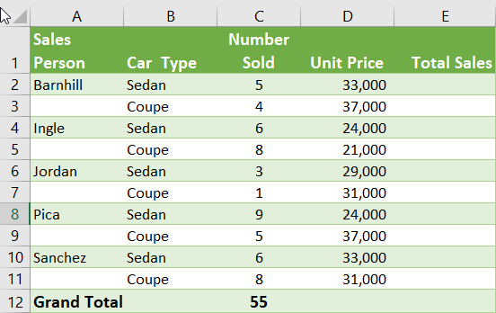
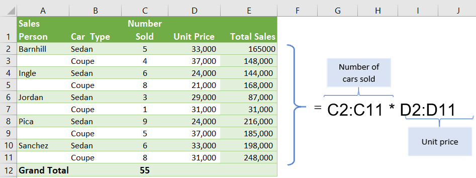
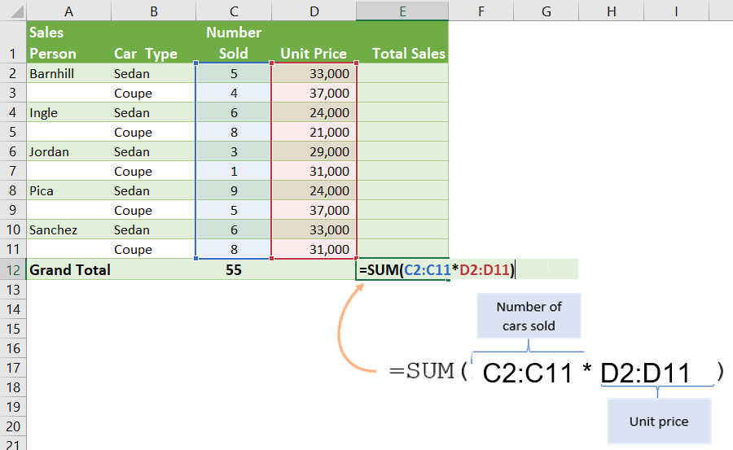

# Array Formulas

An array formula is a formula that can perform multiple calculations on one or more items in an array. You can think of an array as a row or column of values, or a combination of rows and columns of values. Array formulas can return either multiple results, or a single result.

Consider the following table:

In order to calculate the column *Total Sales*, we would typically do the following operations:

1. Enter the multiplication equation in the first cell
	1. `=C2*D2`
2. Then extend the formula to the cells below it.

> However, with array formulas, it's possible to achieve this in a single operation

## Creating multi-cell array formulas

1. Create your formula as normal 
2. Instead of select a single cell, select the whole **range** of cells you would like the formula to apply to.
3. If the formula involves a second **range**, also include this range in your formula
4. Press enter when you are done.

## Single cell array formulas

It is also possible to use array formulas to calculate a single value.

In the car sales example, the *Grand Total* of all sales would typically be calculated by:

1. First calculating the sales totals for each sales person
2. Then summing all the sales to get a total.

> With array formulas it is possible to achieve these two steps as a single operation.

### Creating single-cell array formulas

The process is the same as multi-cell array formulas. The difference is that we start with a function that returns a single value:

1. Create your formula as normal.
2. Instead of select a single cell, select the whole **range** of cells you would like the formula to apply to.
3. If the formula involves a second **range**, also include this range in your formula
4. Press enter when you are done.

Let's watch this [video]([How to Create Array Formulas in Excel - YouTube](https://www.youtube.com/watch?v=7nEyAXiJ304&feature=emb_logo)) for an introduction

## Microsoft 365 vs Legacy Excel

In previous versions of Microsoft Excel (prior to Microsoft 365), array formulas used to be created with the keyboard combo `Ctrl` + `Shifit` + `Enter`.

Starting with Microsoft 365, this keyboard combo is no longer required (but still works).

## References

YouTube: [Excel Array Formulas Explained with MIN and IF Functions (Part 1 of 5)](https://www.youtube.com/watch?v=I23Cy8FkMLY)

YouTube: [How to Create Array Formulas in Excel](https://www.youtube.com/watch?v=7nEyAXiJ304)

## Exercises

1. Download `Previous_practice_labs.xlsx` from Lead and complete the exercises using only Array formulas (multi-cell and single-cell).
2. Download `ArrayFormulas.xlsx` from Lea and complete the exercises.

