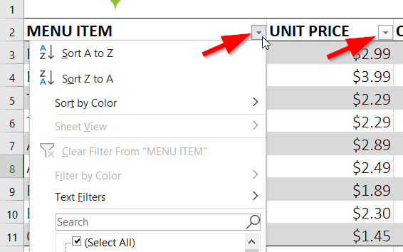
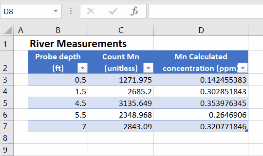
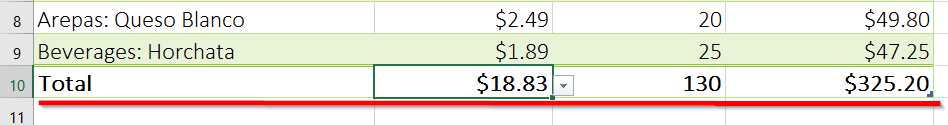
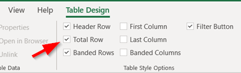
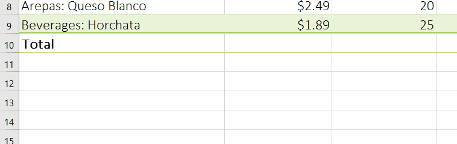
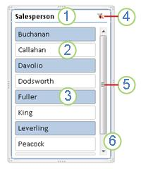
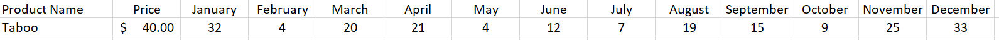

# Excel Tables

Excel tables help you quickly manipulate data that is grouped together.

At first glance, tables look like regular data in a spreadsheet, however, tables automatically add some of the functionality we've already covered such as:
- Filters
- Sorting
- Formatting
- Sum, average, count, etc.

## Creating a Table

1. Click on **any cell** in your data
2. Select *Home > Format as Table* 
3. Choose a table style
4. Verify that the correct range is selected and check *My table has headers* 

## Sorting & Filtering

Once the table is created, sorting and filtering will be automatically add the header rows.

> For details on how to use the sorting and fintering options, see previous lesson from **week 12: Sorting and Filtering**

 

## Adding new data

When new data is added to the table, formating and formulas will automatically grow to include it.

1. Click on an empty cell immediately below the table
2. Enter the data as usual

**This feature works for new data added in rows and columns**

 

## Table totals

Summary cells (sum, average, count, max, min, etc) can easily be added to any column in the table.

1. Click anywhere on the table
2. Select the "*Table Design*" ribbon menu
3. Check ***Total Row***

4. Click on a drop down button of the last row and choose how to summarize that column.

 

## Filtering with Table Slicers

Once a table has been setup, slicers offer a graphical way of filtering data.

### Create a slicer to filter data

1. Click anywhere in the table.

2. On the **Home** tab, go to **Insert** > **Slicer**.

   

3. In the **Insert Slicers** dialog box, select the check boxes for the fields you want to display, then select **OK**.

4. A slicer will be created for every field  that you selected. Clicking any of the slicer buttons will automatically apply that filter to the linked table.

### Slicer components

A slicer typically displays the following components:

1. A slicer header indicates the category of the items in the slicer.

2. A filtering button that is not selected indicates that the item is not included in the filter.

3. A filtering button that is selected indicates that the item is included in the filter.

4. A **Clear Filter** button removes the filter by selecting all items in the slicer.

5. A scroll bar enables scrolling when there are more items than are currently visible in the slicer.

6. Border moving and resizing controls allow you to change the size and location of the slicer

## Resources

[Excel Tables](https://edu.gcfglobal.org/en/excel/tables/1/) by GCF Global

Microsoft Documentation: [Create and format tables](https://support.microsoft.com/en-us/office/create-and-format-tables-e81aa349-b006-4f8a-9806-5af9df0ac664)

Microsoft Documentation: [User slicers to filter data](https://support.microsoft.com/en-us/office/use-slicers-to-filter-data-249f966b-a9d5-4b0f-b31a-12651785d29d)

## Exercises

1.  Go to this [link](https://edu.gcfglobal.org/en/excel/tables/1/) and complete the challenge.
2.  Add the following  to the Challenge completed above:
	1.  Add a totals row using Table features to calculate the following:
		1.  The average unit price
		2.  The Total number of units being ordered
		3.  The Invoice total

3. Download sheet `tables_lab.xlsx` from Omnivox and complete the following steps:
	1. Transform the data into a Table
	2. Add the data below to the table: 

	3. Create a Totals row to calculate the sum of each column

