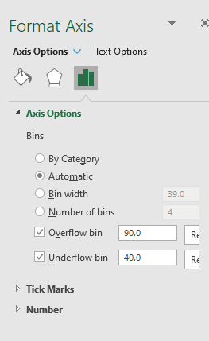
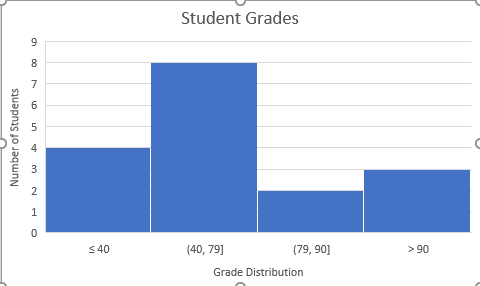

# Histograms

* Histograms are used to display the spread of data within a range.
* When you create a histogram in Excel, you provide two input data and Bin number details.
  * **Input data**:  The data that you want to analyze by using the Histogram tool.
  * **Bin numbers**:  Represent the intervals that you want the Histogram tool to use for measuring the input data in the data analysis. By default, excel creates a set of evenly distributed bins between the minimum and maximum values of the input data.

* Excel counts the number of data points in each data bin.

* A data point is included in a particular bin if the number is greater than the lowest bound and equal to or less than the greatest bound for the data bin. 

**To create a histogram:**

1. Select the data

2. Go to Insert tab

3. Insert statistics chart and select Histogram

4. To change the bin ranges

   1. Right click on the bin and go to format axis.

      

   2. In axis options you can set the:

      * bin width
      * Number of bins
      * Overflow bin value
      * Underflow bin value

   

**References**

* https://support.microsoft.com/en-us/office/create-a-histogram-85680173-064b-4024-b39d-80f17ff2f4e8

* https://www.youtube.com/watch?v=_nUhGuWkSzE&ab_channel=LeilaGharani

  

**Exercises**

Download `histogram_lab.xlsx` from Lea.

1. In the grades sheet, create a histogram for the distribution of grades as shown in the image above.
   * Set the overflow bin to 90 and underflow bin to 40
   * Add proper axis and chart titles.
2. In the Salary sheet, create a histogram for the distribution of salaries.
   * Set bin width to 40,000
   * To have the ranges rounded, set the overflow bin 200,000 and underflow bin to 30,000.
   * Add data labels.

