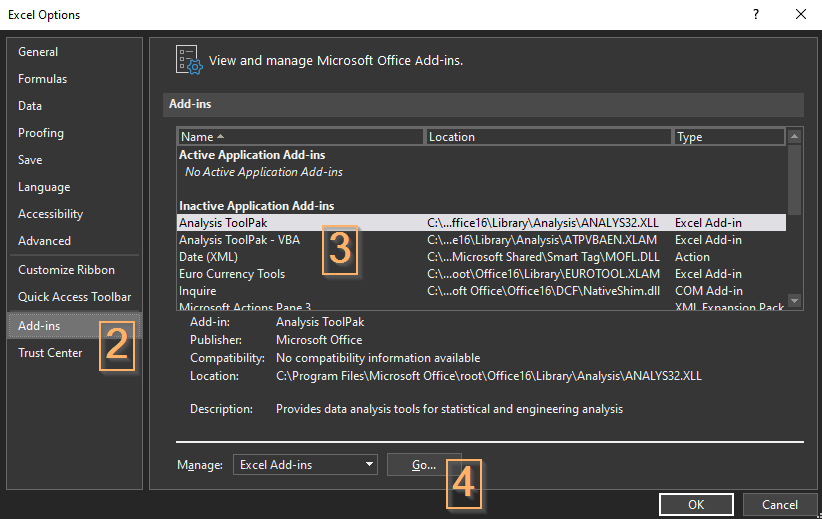
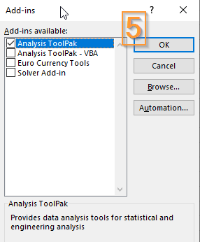
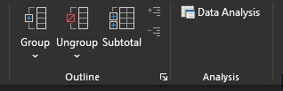
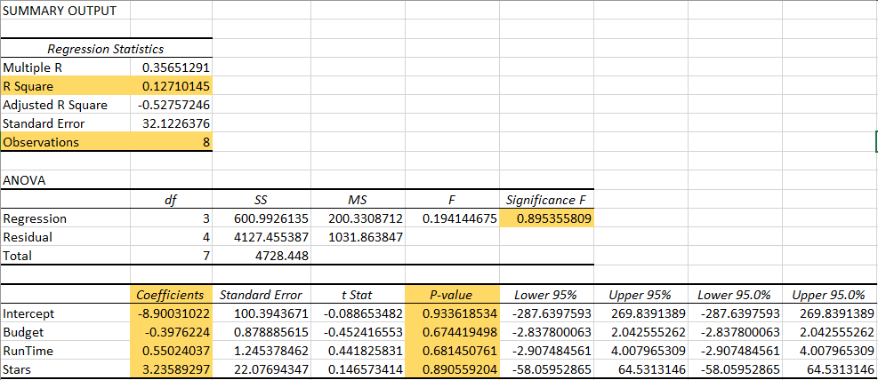

# Regression Analysis

Regression allows us to understand the relationships between one variable and a set of other variables.

## Enabling the Data Analysis 'Add-in'

In order to use the Regression feature in Excel it is necessary to enable an *Add-in* named `Data Analysis`.

1. Select *File* > *Options*
2. Choose the *Add-ins* panel
3. Select the *Analysis ToolPak*
4. Make sure that *Manage: Excel Add-ins* is selected and click *GO*

5. Check only *Analysis ToolPak* and click *OK*

   

A new option called *Data Analysis* should appear under the Ribbon menu *Data*

## Creating a Regression Analysis

In the below example we want to check if Gross Sales is dependent on budget, runtime, and stars.

| Movie              | USA Gross | Budget | RunTime | Stars |
| ------------------ | --------- | ------ | ------- | ----- |
| Who New?           | 56.09     | 30     | 101     | 2     |
| Outer Space Matter | 67.26     | 45     | 136     | 3     |
| Bandana Republic   | 24.4      | 65     | 100     | 2     |
| Code Pink          | 49.77     | 30     | 110     | 3     |
| Ice Teed           | 20.04     | 30     | 109     | 3     |
| Family Trip        | 82.67     | 20     | 94      | 2     |
| Off to College     | 5.17      | 20     | 96      | 1.5   |
| Cocoa Crisps       | 51        | 25     | 105     | 3.5   |

1. Go to **Data** tab > Select **Data Analysis** in **Analysis** group.

2. Select **Regression** > **OK**

3. The **Y-Range** is the variable you are trying to understand or predict. We want to understand what drives gross sales.

4. The **X-Range** is the range we want to check if determines the **Y-Range.** Select the 3 other columns.

   1. When selecting the Y and X-Range, include the column headers to enable labels.

5. Check on the box **Labels**  to make it easier to interpret the data.

   
   

### Key Measures to look at:

* **R Square**: The measure of how much of the change in ticket sales is driven by those three variables. 12% is not very much. Probably need to look deeper at what motivates ticket sales.

* **Observations**: 8 movies

* **Significance F**: We want a number that is smaller than 0.05. Hence, this is not a strong regression.

* **Coefficients**: The numbers that go into the equation of the line. Intercept and Slope of the three variables.

  * A Budget slope -0.39 (negative value) means we have a negative relationship between budget and ticket sales
  * Runtime 0.55 slope indicates longer movie sell more tickets and the weight of 0.55
  * Stars is the strongest with slope 3.23

* **P-value**: A test of whether the coefficients are too close to zero. Zero slope means it has no effect. If the P-value is less than 0.05 we normally say these coefficients have an effect on ticket sales.

  * None of our values are less than 0.05. This implies this regression is not good. We do not have acceptable significance F-test and Coefficient values.

  > If Significance F is greater than 0.05, it's probably better to stop using this set of independent variables. Delete a variable with a high P-value (greater than 0.05) and rerun the regression until Significance F drops below 0.05.

## **Exercises**

Download the `Regression_Lab.xlsx` file from Lea.

Using the `Acetaminophen` sheet

1. Generate the regression analysis of concentration on absorbance. I other words, how is absorbance influenced by concentration?
2. Note the values for R Square, Observations, Significance F, Coefficients, and P-Value.
3. Is there a strong regression between the variables? Why?
4. Plot a scatter chart of absorbance vs concentration
5. Add the trendline and R-squared value

Using the `Products` sheet

1. Generate the regression analysis to find out if there a relation between Quantity Sold (Output) and Price and Advertising.
2. Note the values for R Square, Observations, Significance F, Coefficients, and P-Value.
3. Is there a strong regression between the variables? Why?

**References**

* https://www.excel-easy.com/examples/regression.html
* https://www.youtube.com/watch?v=0lpfmFnlDHI&ab_channel=TobinPorterfield