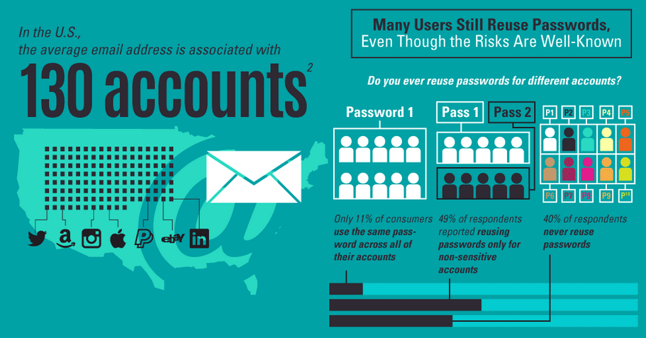
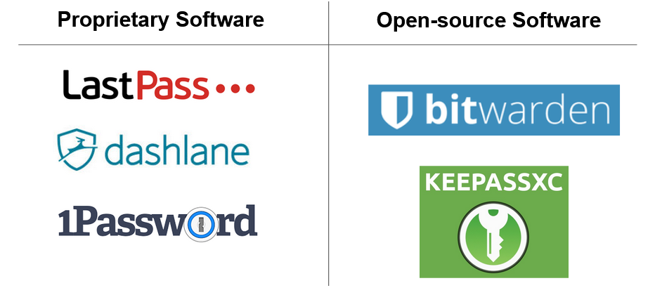

# Stolen Data & Password Managers

In this chapter we will talk how a typical data breach happens and best practices to keep your passwords safe.

  ## Data Leaks

Any computer with a public IP is subject to someone trying to connect to it.

  > There is no such a thing as a perfectly secure computer.
  >
  > Due to the complexity and fast development of computer science, new bugs and vulnerabilities are constantly being found.

Automated bots can be programmed to scan the internet and try to connect to every single computer it finds. With billions of computers on the internet, it's just a matter of time until they find an unsecure computer.

   

  Most data is stolen because of two reasons:

  1. The computer was not setup properly and left connections exposed.
  2. There was a exploitable vulnerability in one of the programs running on this computer.

  

  ### Misconfigured Computers

Thanks to cloud computing services, it is very easy for someone to setup a publicly accessible computer. However, properly securing and maintaining the server takes time and/or experience.

A common source of data leaks come from misconfigured online storage such as Amazon S3 storage.

   

A few articles with examples of leaked data from Amazon S3 storage: (click on images for access)

   

  

   

  

   

  

   

  ### Exploitable Vulnerabilities

Software bugs are commonly being found. This include poor coding skills, bad design decisions and lack of testing. Sometimes it's impossible to foresee the ways in which the software could be exploited.

   

There are many **automated** [vulnerability scanners](https://en.wikipedia.org/wiki/Vulnerability_scanner) that can scan a computer or a network to find known exploitable bugs in commonly used software.

  > It's very important to keep your software and operating system up to date!

   

  ## Getting "Hacked"

Most people think that their accounts are hacked because they were the target of an orchestrated and sophisticated attack.

Although that happens, it is rare. In reality, getting hacked is quite simple:

   

  

  
<a href="https://www.explainxkcd.com/wiki/index.php/2176:_How_Hacking_Works"><em>How Hacking Works by explainxkcd.com</em></a>

   

  ## Reusing Passwords

  If you are aware of how common data leaks are, then you understand why reusing passwords are a bad idea.

  A study from Digital Guardian in 2017 reveled the following:

   

  

  
<a href="https://digitalguardian.com/blog/uncovering-password-habits-are-users-password-security-habits-improving-infographic"><em>60% of people in the US reuse their passwords to some degree</em></a>

   

  Even if your password is incredibly unique, it only takes one data leak for it to become known to the internet.

   

  

  
<a href="https://www.chron.com/life/article/Does-your-password-pass-the-test-3684407.php"><em>It is not a matter of making your password unique.</em></a>

   NordPass has compiled a list of [the top 200 most common passwords](https://nordpass.com/blog/top-worst-passwords-2019/) according to 500 million leaked passwords (compiled by security researches).

   

  > Leaked passwords create a database that anyone trying to login into your account can use.
  >
  > There are automated scripts that will first try all known passwords and dictionaries words before trying random characters.

  ### Have I been pwned?

  > To check if your account information has been leaked in a hack, check the site below:
  >
  > https://haveibeenpwned.com/

   

  ## Good Password Habits

  Developing good password habits comes down to the following:

  **Step 1:** Don't reuse passwords.

  **Step 2:** Create strong passwords.

  **Step 3:** Make passwords that are easy to use (not the same as easy to remember).

   

  ### Strong Passwords

  Here is a list of recommendations for creating strong passwords:

  1. Avoid favorite sports teams or pop culture references.
  2. Don’t use a single word like sunshine, monkey, or football.
  3. Don’t use common number patterns like 111111, abc123, or 654321.
  4. Combine unrelated words to create a passphrase.
  5. Adding a number or piece of punctuation at the end doesn’t make your password stronger.
  6. Avoid switching a letter for a symbol (p@ssw0rd!). Keep it human friendly.

   

  #### Keeping it Human Friendly

   

  

  
<a href="https://xkcd.com/936/"><em>Human friendly passwords by explainxkcd.com</em></a>

   

 ### How to keep track?

 If reusing passwords is bad and the average person has over 100 accounts, how does one keeps track?

 **The piece of paper**

 In theory it is perfectly feasible to keep track of your passwords in a piece of paper. However, over time, the added effort that it requires is likely to eventually lead to reusing passwords.

 In practice, you might just not have that piece of paper with you whenever you need it.

  

 This is where password managers offer a **compromised solution**.

  

  ## Password Managers

  Password Managers are an encrypted database of passwords that is protected by a master password.

  **Advantages**

  - Vast storage. Can store all the passwords you will ever need in digital format.
  - Strong passwords. Auto generate strong random passwords or passphrases based on settings.
  - Faster workflow. It can auto-fill or copy passwords to clipboard, removing the need for typing.

  **Disadvantages**

  - Single point of failure. Master password becomes a critical piece of information. It should be made very strong and managed carefully.

   

  There are many options to choose from. Here are just some of them:

   

  

   

  Most of the suggestions above have browser integrations that can auto-detect and auto-fill password fields.

  **Where is my data?**

  Some passwords managers are cloud-based, meaning you can sync them across multiple devices and some are local applications.

  KeepassXC is an example of an open source and local application that you can run on your computer alone.

  Remember that even if your password database is in the cloud, it is encrypted with a strong password.

   

  ## Two Factor Authentication (2FA)

  The fundamental limitation of passwords is that **it is text that can be easily shared**.

  It is possible to add an additional layer of security to an authentication process that cannot be shared.

  > Two Factor Authentication (2FA) requires a user to posses two things:
  >
  > Something you "know" + Something you "have"

  The idea is that **in addition to** entering a password (something you know) a user needs a piece of hardware that only they are supposed to have (something you have).

  Even if the password is compromised, the account remains safe.

   

  ### Examples of 2FA

  Here are some examples of Two Factor Authentication:

  #### Time-based One-time Password Algorithm (TOTP)

  - A temporary token (code) that changes every X seconds.

  - Typically done by a dedicated device like a pager or a cellphone app

     

  

   

  #### NFC - Near Field Communication

  - A radio wave signature that is unique to a device.
  - For example, a smartphones' NFC radio.

   

  

  
<a href="https://www.digitaltrends.com/mobile/what-is-nfc/"><em>Paying with your phone is an example of NFC</em></a>

   

  #### A U2F Key (Universal Two-Factor)

  - A physical key device typically shared like a USB that can plug and transfer a unique hard-coded signal.

  

  
<a href="https://www.pcmag.com/news/own-your-own-identity-with-universal-two-factor-authentication"><em>The Yubikey is an example of U2F keys</em></a>

   

  #### Temporary Code to SMS

  Some services will offer to text you a temporary secret token directly to your cellphone.

  This is a form of Two Factor Authentication because you are the only person supposed to have access to that phone number.

  However, many security specialists suggest that this is not considered secure.

  > That bein said, SMS tokens are **still better than no 2FA at all**

   

  If you are curious about why SMS tokens are not considered secure, take a look at the links below:

  - [This is why you shouldn’t use texts for two-factor authentication](https://www.theverge.com/2017/9/18/16328172/sms-two-factor-authentication-hack-password-bitcoin), theverge.com
  - [6 Ways Attackers Are Still Bypassing SMS 2-Factor Authentication](https://www.securityweek.com/6-ways-attackers-are-still-bypassing-sms-2-factor-authentication), securityweek.com
  - [SMS-based two-factor authentication is not safe](https://www.kaspersky.com/blog/2fa-practical-guide/24219/), kaspersky.com