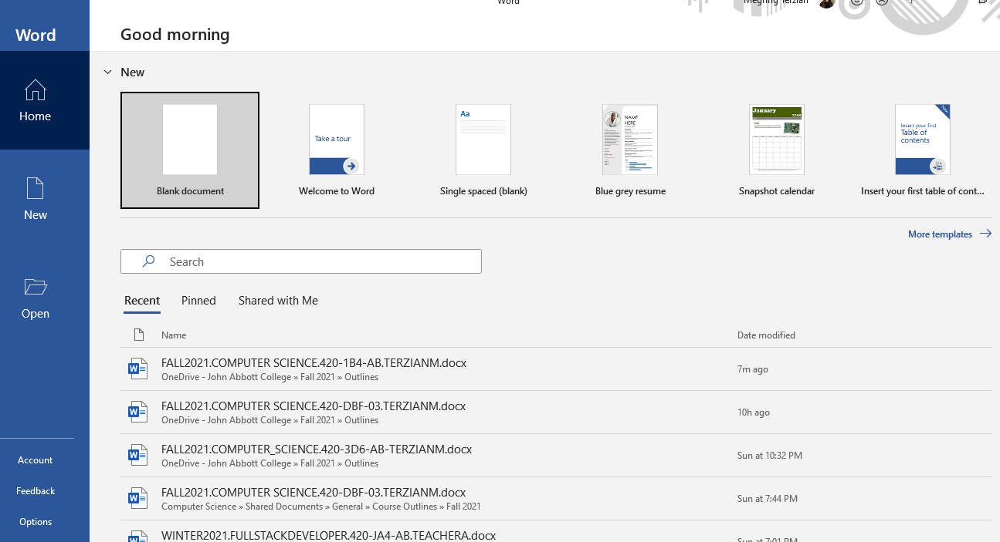
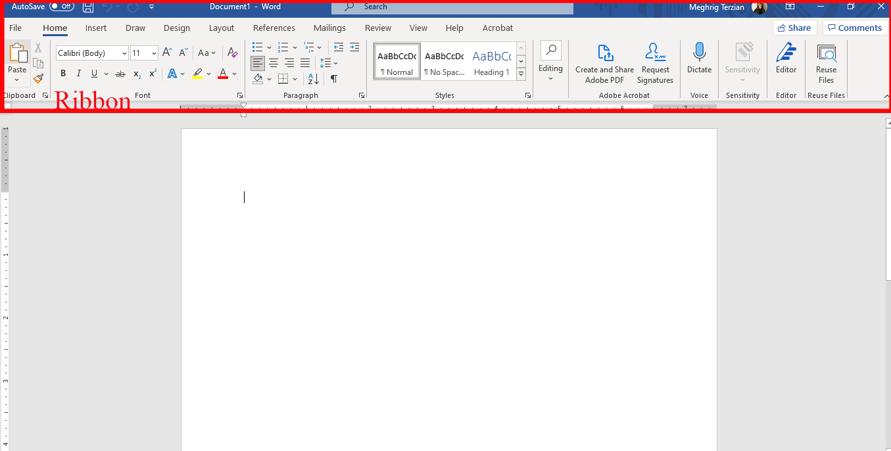
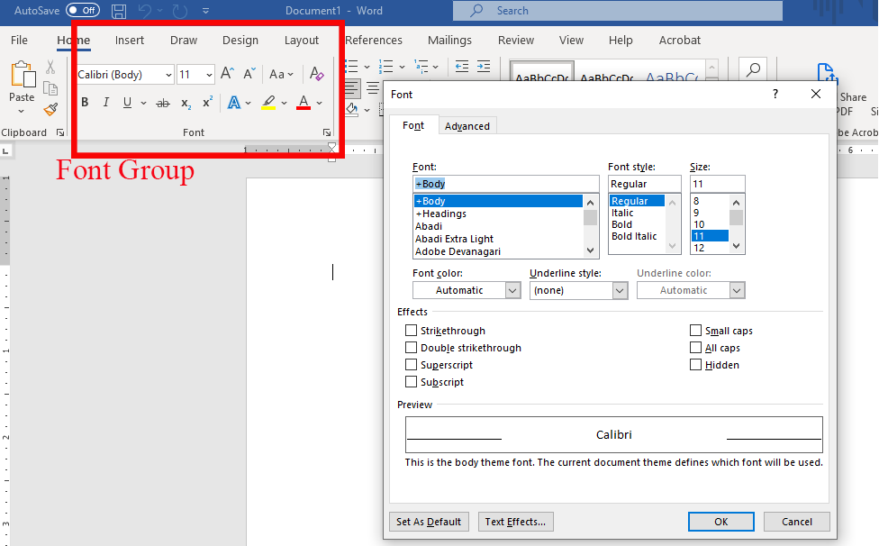
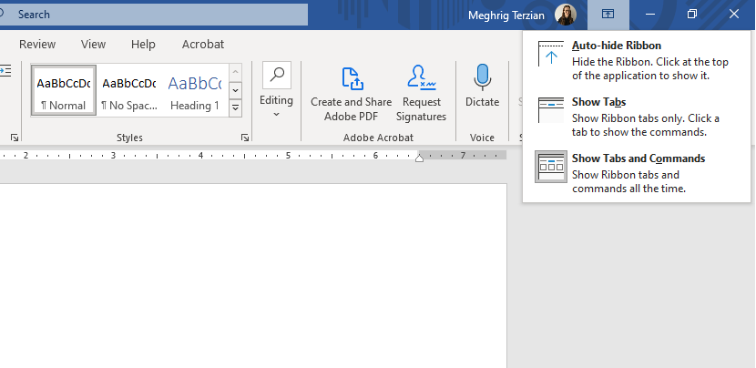
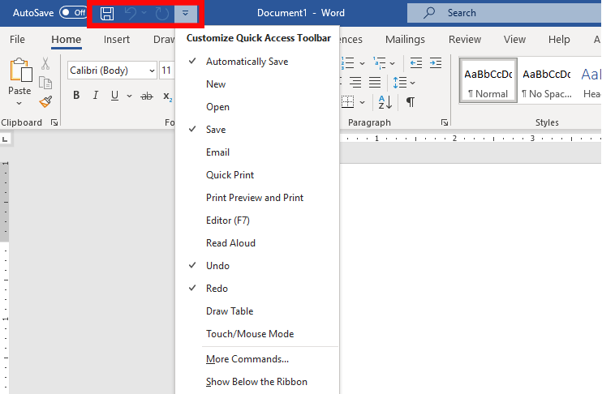
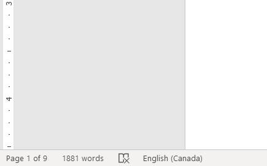
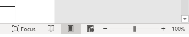
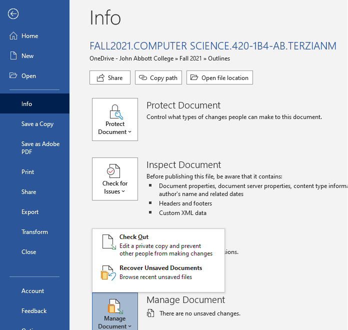
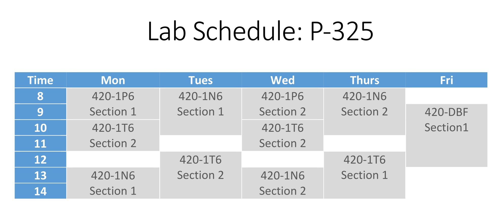

# Introduction to MS Word

Microsoft Word is a powerful word-processing program. It allows you to create a variety of **documents**, including letters, resumes, and reports.

## Word Interface

When you open word the start screen will be displayed. From there you can access recent documents or create something new (blank or from a template).

### The Ribbon, Tabs and Groups

The **Ribbon** is divided into **tabs** like **Home**, **Insert**, **Draw**, **Design**.

Each **Tab** has groups. For example, the **Home** tab has **Font**, **Paragraph**,  and **Styles** groups.

Some groups have a **small arrow** in the bottom-right corner that you can click for even more options.

### Ribbon Display Options

You can change the display options of the ribbon by clicking the **Ribbon Display Options** arrow in the upper-right corner of the Ribbon, and then selecting the desired option from the drop-down menu.

## Office Account

From the upper right corner, you can also access your office account. Sign out or Sign in with a different account.

 ## Search bar

If you are not being able to find a command you need, the **Search** bar can help. It works just like a regular search bar. Type what you're looking for, and a list of options will appear. You can use the command from the menu without having to find it on the Ribbon.

## Quick Access Toolbar

The toolbar gives you access to frequently accessed commands. You can customize it.

## The Ruler, Page numbers and Word count

The Ruler makes it easier to **adjust** the layout of your document with precision. If you want, you can hide the Ruler to create more screen space. Go to **View** tab, click the checkbox next to **Ruler** to **show** or **hide** the Ruler.

You can also see the number of pages in the document and the number of words on the lower left corner.

On the lower right corner there are tools that help you choose how you want to display your document.

* Zoom in or out

* Document View Options

  * Read Mode: Opens the document in full screen
  * Print Layout: Default, shows how the document will look like on a printed page.
  * Web Layout: Displays the documents as a webpage

## Backstage View

Access it by clicking on the **File** tab.

Has information related to your current document. You also have commands like New, Print..

## Creating & Saving Documents

### Creating a new document

Go to Backstage View and choose new. You start a blank document or a document from a template. A template comes with a preexisting design. Click on more templates to search and find more templates.

### Creating an existing document

To open an existing document, do to Backstage View and choose Open.

You can also choose from the list of  recent document you have worked on. It is also possible to pin documents. 

### Compatibility Mode

Sometimes you may need to work with documents that were created in earlier versions of Microsoft Word. In such cases the document will be open in compatibility mode and you can only access features of that version of word.

To exit Compatibility Mode, you van convert the document to the current version. Go to Backstage view, locate and select the **Convert** command.

### Saving Documents

1. Can use the save command on the **Quick Access Toolbar.**

2. If it is a new document go to Backstage View and choose where you want to save your file.

3. You can save a different version maybe in a different location go to **Backstage View** and choose **Save a Copy**.

   > you can set a default location by selecting **Options** from the backstage view. Then select **Save** in the left pane and choose a location.

### AutoRecovery Feature

Word automatically saves your documents to a temporary folder while you are working on them. If you forget to save your changes or if Word crashes, you can restore the file using **AutoRecover**.

Reopen Word, if **autosaved versions** of a file is found, the **Document** **Recovery** pane will appear on the left.

If you don't see the file you need, you can browse all autosaved files from **Backstage** **view**. Select the **Info** tab, click **Manage Document**, then choose **Recover Unsaved Documents**.

## Exporting documents

* Word documents are saved in the **.docx** file type
* However, there may be times when you need to use **another file type**, such as a **PDF** or older version of word.

To export a document as a PDF file:

Click the **File** tab to access **Backstage** **view**, choose **Export**, then select **Create Adobe PDF**.

To change file type:

Click the **File** tab to access **Backstage** **view**, choose **Export**, then select **Change File Type.**

 

## Tables in Word

📖 For this section of the notes please refer to the following resources:

- [Tables](https://edu.gcfglobal.org/en/word/tables/1/)

## Hands-on  

### Exercise 1

Re-create the table in the image below in MS Word by using the tables feature.

> Your tables does not needs to be identical but should get really close.Refer to the following image and complete the steps below:	

## References

* [Getting Started with Word](https://edu.gcfglobal.org/en/word/getting-started-with-word/1/) by GCF Global
* [Creating and Opening Documents](https://edu.gcfglobal.org/en/word/creating-and-opening-documents/1/) by GCF Global
* [Saving and Sharing Documents](https://edu.gcfglobal.org/en/word/saving-and-sharing-documents/1/) by GCF Global

