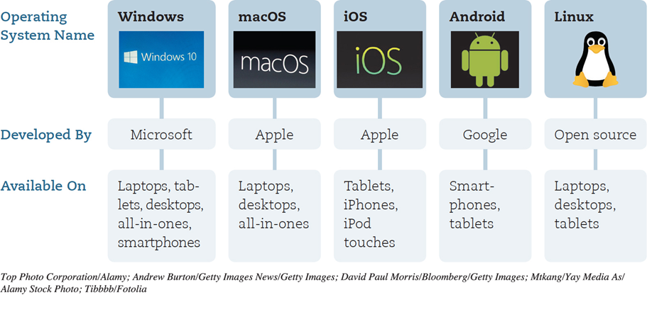
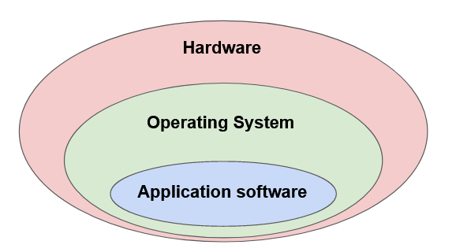
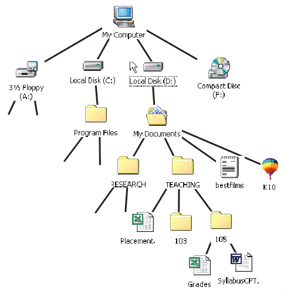
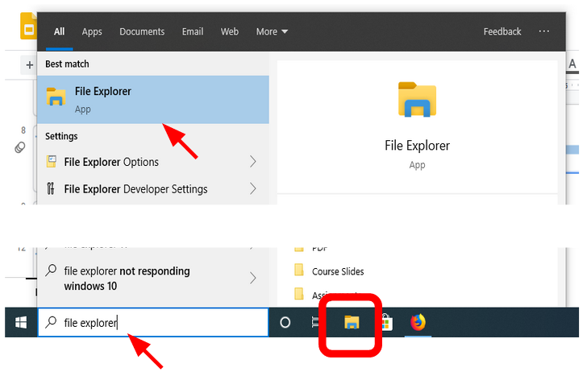
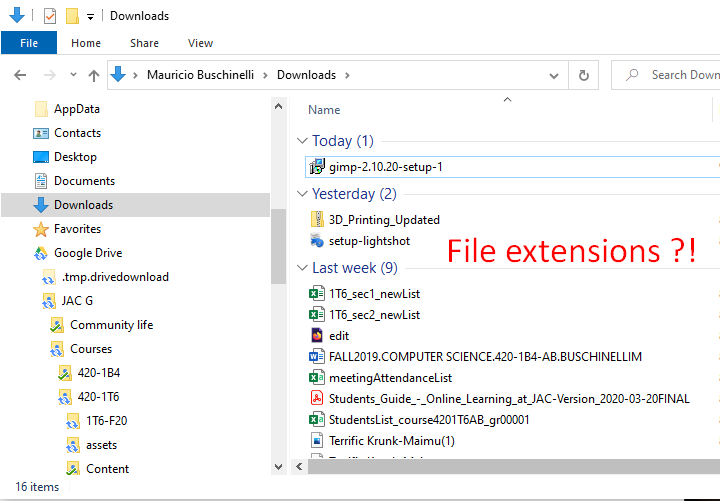
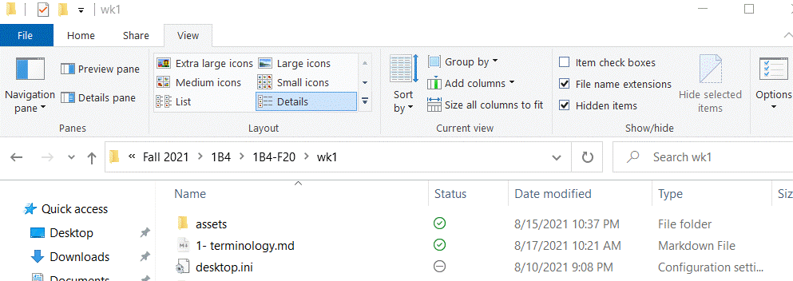

# Intro to Operating Systems

In this section we will take a look at how the operating system software interacts and controls the hardware.

Previously we had defined **software** as: *any **set of instructions** that tells the hardware **what to do** and **how to do it**.*

Let's focus on two types of software: **the operating system and application software**

 

**Operating System / System Software**

>  An operating system is a set of programs that:
>
>  - Runs inside the hardware
>  - Communicates with and manages the hardware 
>  - Hosts and runs application software, allowing application software to work with CPU
>  - Performs general housekeeping tasks for your computer: like system maintenance and file compression
>  - User Interface: how users interact with the computer (command line, menu, or Graphical User Interface -GUI)
>  - Can multitask

 

 

**Application Software**

> Programs that run and execute instructions inside the operating system.
>
> Examples: Microsoft office, internet browsers, games

 

Hosting relationship between Hardware and Software

 

## The Computer File System

Every single program, image, video, document, etc, exists in your computers as file located somewhere in the File System.

 

 

The computer file system is organized as a tree, where the origin of each tree is the **root directory**

In Windows, the root directories are assigned a letter and usually represent a Storage Drive.

 

Windows file system with four root directories (A:, C:, D:, F:)

 

Files systems normally contain:

- **Data** (the files)
- **Directories** (folders)
- **Metadata** (information about the data itself)
  - File size
  - File type (or file extension)
  - Time modified

 

### File Types

Each file can hold information in a different formats.

For example, an image file stores image information in a completely different way than a text file.

> To quickly distinguish between the different types files, we use a file extension at the end of each file type

 

Here are some examples of file types and their extensions:

| **Images** | **Documents** | **Audio** | **Video** | Compressed files |
| ---------- | ------------- | --------- | --------- | ---------------- |
| .png       | .docx         | .mp3      | .mp4      | .rar             |
| .jpeg      | .txt          | .wav      | .avi      | .zip             |
| .gif       | .html         | .flac     | .webm     | .7z              |

 

### File Manager Software

> A File Manager is an application software that helps us navigate, find, organize and manage files and folders in file system.

Compare this to the way you organize your notes and important documents at home

 

 

In Windows the file manager is called **File Explorer**.

 

 

### Showing file extensions

By default File Explorer hides the file extensions. 

 

Microsoft choose to do this to simplify the user interface and not overwhelm new users.

**If you would like to see the file extensions directly on File Explorer you have to enable it**

Enabling file extensions is not necessary but it will allow you to better understand what kinds of files you are dealing with "under the hood".

 

To enable the file extensions in File Explorer select the *View Menu* and click on the *File name extensions* check box.

 

 

### File Properties

To view in-depth information about a file you can open it's properties dialogue.

From File Explorer, right-click on the file and select ***Properties***

 

## Compressed Files

> Some files in the computer can be compressed in order to save space. 
>
> Compressed files are typically called **Zipped files**.

 

In order to compress a file you need a **File compressor program**. 

Windows comes with a File Compressor program by default but you can choose to install other programs that achieve the same task.

 

Here are some examples of the File Compression programs and their respective file formats:

| Name of Compression Program               | Compressed file type extension |                             Icon                             |
| ----------------------------------------- | :----------------------------: | :----------------------------------------------------------: |
| Windows Default Compressor                |              .zip              |  |
| 7-Zip                                     |              .7z               |  |
| WinRAR (**not accepted for submissions)** |              .rar              |  |

 

### Zip and Unzip Files

To zip (compress) or unzip (extract) files follow the instructions below:

#### Compressing Files

1. Locate the file or folder that you want to zip.

2. Right-click the file or folder, select **Send to**, and then select **Compressed (zipped) folder**.

A new zipped folder with the same name is created in the same location.  To rename it, right-click the folder, select **Rename**, and then type the new name.

 

#### Extracting Files

1. Locate the zipped folder that you want to unzip (extract) files or folders from.

2. Do one of the following:

- To unzip a single file or folder, open the zipped folder, then drag the file or folder from the zipped folder to a new location.

- To unzip all the contents of the zipped folder, right-click the folder, select **Extract All**, and then follow the instructions.

   

#### ⚠ Using Zipped "Folders"

> The contents inside a zipped file are READ-ONLY!
>
> You will not be able to modify them without extracting first.

 

In windows you have the ability to double click onto a zipped file and File Explorer will show you the contents of the zipped file **as if you were inside a folder** - it's a trap!

  This can be very misleading and stressful when working on assignments or tests.

**Please get into the habit of always extracting a compressed file before working on it.**

 

## Creating Files and Folders

There are many ways to create new files and folders in Windows. We will cover two methods:

### Using File Explorer

1. Using File Explorer, navigate to the location where you would like to create your new file.
2. Right-click on an empty area of the folder
3. Choose "New"
4. Choose the type of file or folder to be created.

 

> To create an application file such as Microsoft Excel or Word using this method, you need to make sure that the application is installed on your computer.
>
> Otherwise it will not be available.

 

### Using the Application

It is also possible to create a new file of any type using the application to generate that file.

The instructions below use Microsoft Excel but the process is similar in any application.

1. Open the application
2. Choose to create a new blank file
3. In the application, find the "File" menu, typically located in the top-left of the screen.
4. Choose "Save-as"
5. Select the location where you would like to save your file and give it a file name.
6. Click Save.

 

## Keyboard Shortcuts

* `Ctrl + x` : cut
* `Ctrl + c` : copy
* `Ctrl + v` : paste
* `Ctrl + z`:  undo
* `Ctrl + y`:  redo
* `home`: takes the cursor to the start of the line
* `end`: takes the cursor to the end of the line

## Syncing files with OneDrive

### What is OneDrive?

* Cloud storage provider

* Store in the cloud? Store it on Microsoft's servers

* Benefits:
  * Backup
  * Access files from anywhere 
  * Share & Collaborate

* Can get the app from Appstore or Playstore

* Other cloud storage providers: Google Drive, Dropbox, and iCloud
* When you add, modify, or delete a file or folder in your OneDrive folder, the actions will be made on OneDrive and vice versa. 
* It is also possible to work offline in File Explorer, and sync after. 

### Files On-Demand statuses

1. Online Only: 

   * Not saved on your computer. 

   * When you open an online only file, it is downloaded to your device. 

   * Cannot be opened when you are not connected to the Internet.

2. Locally available file: 

   * Can be opened any time with or without internet access. 

   * If you want to change the status of a file to online only, right-click the file and select “Free up space".

3. Always keep on this device:

   * Files are on your device and take up space

   * Can access it even when you are offline.

 

## Exercises

### Exercise 1: Compress, de-compress & upload

1. In Lea, you will find a compressed file. Please complete the following activity:

   1. Download the file: *Practice exercise - Compressing Files*
   2. Decompress it in a location of your choice
   3. Organize the files into folders:
      - Create a main folder named *Practice1*
      - Create a folder for each file type
        - Ex.: Images, Videos, Documents
   4. Create and save an Excel file (empty)
      - New -> Save As
   5. Compress the main folder *Practice 1*
   6. Upload the compressed folder to Lea

### Exercise 2: Creating & moving folders

2. Folder creation and Moving

   * Create folder with name `folder1` on the desktop
   * Create folder with name `folder2` in documents
   * Create folder with name `folder3` in downloads
   * What is the location of `folder 1` from the root directory?
   * What is the location of `folder 2` from the root directory?
   * What is the location of `folder 3` from the root directory?
   * Move `folder 3` inside `folder 2`
   * Move `folder 2` inside `folder 1`
   * What is the location of `folder 1` from the root directory?
   * What is the location of `folder 2` from the root directory?
   * What is the location of `folder 3` from the root directory?

### Exercise 3: System properties

3. Check your system properties and write down the capacity of the processor and the capacity of the disk.

### Exercise 4: OneDrive

4. In lea you will find a `lab-onedrive.pdf` file.
   1. Download the file.
   2. Complete all the steps.