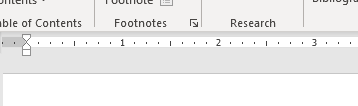
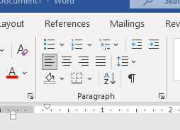

# Tabs, Headers, Footers, Page Numbers, Reviewing, Images, and Charts

Word has an extensive set of features.

In this chapter we will focus on features that will give you more control over how your document is displayed as well as the quality of the content that you include.

 

## Indenting and Tabs

Indenting text adds structure to your document by allowing you to separate information.

#### Tab keys

A quick way to indent is to use the **Tab** key. This will create a first-line indent of **1/2 inch**.

* Place the insertion point **at the very beginning** of the paragraph you want to indent, and press the **Tab** key.
* On the Ruler, you should see the **first-line indent marker** move to the right by **1/2 inch**.
* If you can't see the Ruler, select the **View** tab, then click the checkbox next to the **Ruler**.

Word provides **indent markers** that allow you to indent paragraphs to the location you want.

- **First-line indent marker**  adjusts the first-line indent

- **Hanging indent marker**  adjusts the hanging indent

- **Left indent marker**  moves **both** the first-line indent and hanging indent markers at the same time (indenting all lines in a paragraph)

#### Indent markers

* Place the insertion point anywhere in the paragraph you want to indent, or select one or more paragraphs.
* Click and drag the desired **indent marker**.

#### Indent commands

* Place the insertion point anywhere in the paragraph you want to indent.

* On the **Home** tab, click the **Increase Indent** or **Decrease Indent** command.

* The Indent commands will adjust the indent by **1/2-inch increments**, but it is customizable.

* To customize the indent amounts, select the **Layout** tab near the desired values in the boxes under **Indent**.

#### Tab Stops

Adding **tab stops** to the **Ruler** allows you to change the size of the tabs, and Word even allows you to apply more than one tab stop to a single line. For example, on a resume you could **left-align** the beginning of a line and **right-align** the end of the line by adding a **Right Tab**.

The **tab selector** is located above the **vertical ruler** on the left. Hover the mouse over the tab selector to see the name of the active **tab stop**.

### Types of Tab stops

- **Left Tab**  left-aligns the text at the tab stop

- **Center Tab**  centers the text around the tab stop

- **Right Tab**  right-aligns the text at the tab stop

- **Decimal Tab**  aligns decimal numbers using the decimal point

- **Bar Tab**  draws a vertical line on the document

- **First Line Indent**  inserts the indent marker on the Ruler and indents the first line of text in a paragraph

- **Hanging Indent**  inserts the hanging indent marker and indents all lines other than the first line

> 📖 For this section of the notes please refer to the following resource
> 
> [Youtube: Indents and Tabs](https://youtu.be/vJGYWVe52T4?t=134)

#### Removing tab stops

It's a good idea to remove any tab stops you aren't using so they don't get in the way. To remove a tab stop, first select all of the text that uses the tab stop. Then click and drag it off of the Ruler.

 

Word can also display hidden formatting symbols such as spaces (), paragraph marks (), and tabs () to help you see the formatting in your document. To show hidden formatting symbols, select the **Home** tab, then click the **Show/Hide** command.

 

## Headers and Footers

> 📖 For this section of the notes please refer to the following resource:
> 
> [Word: Headers and Footers ](https://www.youtube.com/watch?v=lNdjuIYuB3o&t=149s)

### Design tab options

When your document's header and footer are unlocked, the **Design** tab will appear on the right side of the Ribbon, giving you various editing options:

* Hide the first-page header and footer
* Remove the header or footer
* Page Number
* Additional options: With the commands available in the Insert group, you can add the  date and time, document info, pictures, and more to your header or footer.

 

## Insert page numbers

1. Select **Insert** > **Page Number**, and then choose the location and style you want.
2. If you don't want a page number to appear on the first page, select **Different First Page**.
3. If you want numbering to start with 1 on the second page, go to **Page Number** > **Format Page Numbers**, and set **Start at** to **0**.
4. When you're done, select **Close Header and Footer** or press Esc.

 

## Grammar & Spelling

Microsoft Editor analyzes your document and offers suggestions for spelling, grammar, and stylistic issues. To use Editor, on the **Home** tab choose **Editor**.

### Reviewing suggestions

* Choose a correction or refinement type, then use the arrows near the top of the pane to step through each of that type of issue.

* Choose a suggestion to incorporate it into your document. If you don't like the suggestion, choose **Ignore Once**. Or, if you never want this type of suggestion, choose **Don't check for this issue**.

By default, Editor checks for several categories of issues. To modify tune Editor for suggestions you want, do the following:

* In the Editor pane, choose **Settings**.
* In the Word Options dialog box, next to **Grammar & Refinements**, choose **Settings**.
* Scroll through the list of options. Select issues you want Editor to check, and clear the issues you want Editor to ignore.
* Choose **OK**.

 

## Formatting Pictures

> 📖 For this section of the notes please refer to the following resource:
> 
> [Word: Formatting Pictures](https://www.youtube.com/watch?v=eC4bRXx9k6g&t=12s).

### Picture Styles group

Contains different **predefined styles** that make image formatting even easier. Picture styles are designed to **frame** your image without changing its basic settings or effects.

 

## Inserting and Excel Chart

* The simplest way to insert a chart from an Excel spreadsheet into your Word document is to use the copy and paste commands.

* You can make changes to the chart in Word.
  * Go to **Chart Design** or **Chart Tools Design** > **Data** > **Edit Data** and choose one of the following:
    - Choose **Edit Data** to edit the chart in Word.
      * Use any of the four buttons that appear when you select the chart.
        1. **Layout Options**
           Choose how your object interacts with the text around it.
        2. **Chart Elements**
           Add, remove, or change chart elements such as the title, legend, gridlines, and data labels.
        3. **Chart Styles**
           Set a style and color scheme for your chart.
        4. **Chart Filters**
           Edit what data points and names are visible in your chart.
    - Choose **Edit Data in Excel**.
* If you change the data in Excel, you can automatically refresh the chart in Word. 
  * Go to **Chart Design** or **Chart Tools Design** > **Data** > **Refresh Data**.

 

## References & Guides

- [Indents and Tabs](https://edu.gcfglobal.org/en/word/indents-and-tabs/1/)
- [Headers and Footers](https://edu.gcfglobal.org/en/word/headers-and-footers/1/)
- [Insert page numbers](https://support.microsoft.com/en-us/office/insert-page-numbers-9f366518-0500-4b45-903d-987d3827c007)
- [Check grammar, spelling, and more in Word](https://support.microsoft.com/en-us/office/check-grammar-spelling-and-more-in-word-0f43bf32-ccde-40c5-b16a-c6a282c0d251)
- [Pictures and Text Wrapping](https://edu.gcfglobal.org/en/word/pictures-and-text-wrapping/1/)
- [Formatting Pictures](https://edu.gcfglobal.org/en/word/formatting-pictures/1/)
- [Insert a chart from an Excel spreadsheet into Word](https://support.microsoft.com/en-us/office/insert-a-chart-from-an-excel-spreadsheet-into-word-0b4d40a5-3544-4dcd-b28f-ba82a9b9f1e1)

 

As an excellent written resource with step by step instructions, see:

> [Microsoft Office Word: Formatting Your Document](https://apps.kennesaw.edu/files/pr_app_uni_cdoc/doc/Word_2016_PC_Formatting_Your_Document.pdf) by Kennesaw State University

 

## Demonstration Article

Access the article used to demonstrate the features covered in this lesson here:
[Building Belonging: Pharma’s New Focus in DE&I](https://www.pharmexec.com/view/building-belonging-pharmas-new-focus-in-dei)

 

## Exercises

### Formating Document Elements

Download the compressed folder `Formatting-document.zip` from Lea and extract its content. 

1. Open Word file *Internship-Programs.docx* and re-format the document so it looks like images *Internship-Programs_pg1.png* and *Internship-Programs_pg2.png*
   * Hint: Use tab stops
2. Include the image *w01C_Building.jpg* with the appropriate text wrapping.
3. Use Word's spelling and grammar rules to correct any language mistakes.
4. Insert "Fall 2021" as the page footer.
5. Insert page numbers in the top right of the pages.
6. Insert the chart from *video-salaries.xlsx* anywhere inside your Word document but make sure the data is linked.
   * Change a value in your Excel file and update the chart in the Word document.

