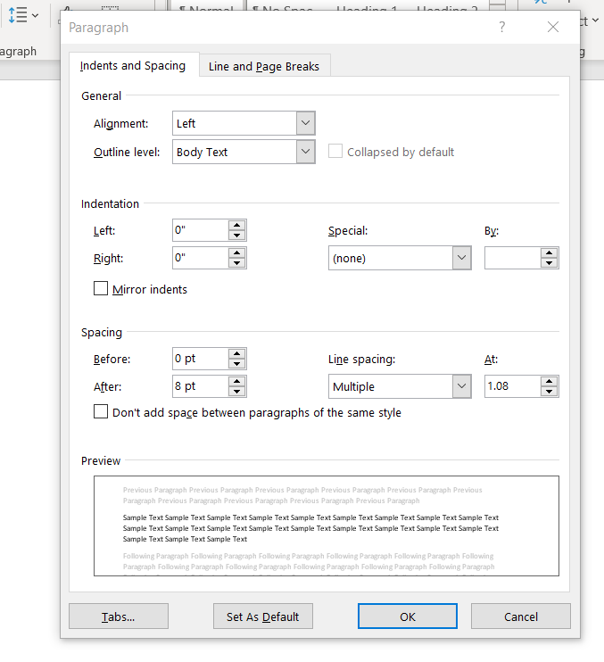
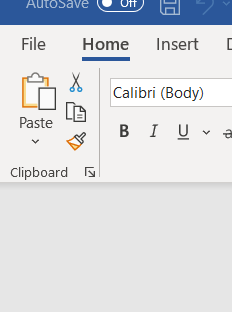
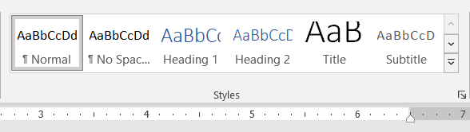
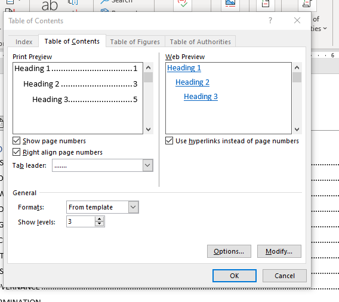

# Text Formatting & Using Styles

## Quick Styles

Top: Always format your document after you are done writing your document.

Formatting sections of a document manually is tedious and time consuming.

-   Alignment
    
-   Font size
    
-   Font Color
    
-   Spacing (carriage returns are bad, use space after paragraph instead)
    
  
    

**Copying existing styles**

-   Format Painter could be used, that copies the format. You can reapply it on other sections of your document.
    

### Using Quick Styles

-   Predefined styles, ready to be used.

-   You don't have to worry about sizes of different headings. Heading 1 compared to heading 2.

-   Existing Styles could be modified.

-   Located in **Home tab**, **Styles gallery**.

-   To apply a style, **select the text** and then click the style you want from the **Styles gallery**.

-   To Modify a style, right click on a style and click Modify.

	-   You can choose whether the style changes apply to the current document or to all future documents.

-   Formatted text in your document could be saved as a new style. **Right click** on the text, in the mini toolbar click Styles and then click **Create a Style**.
        

## The Design Tab

To change the overall look of the document, **style sets** and **themes** can be used.

> 📖 For this section of the notes please refer to the following resources by Microsoft:
>
>[Different Styles and Themes](https://support.microsoft.com/en-us/office/different-looks-with-styles-and-themes-64849596-2cd2-4459-9a75-e42727522021)
    

## Create Table of Contents

Using the headings in your document, word can create an automatic table of contents and keep it updated if you make any changes. To create a table of contents:

1.  Put your cursor where you want to add the table of contents.
    
2.  Go to **References** > **Table of Contents** and choose an automatic style.
    
3.  When you make changes to your document that affect the table of contents, update the table of contents by right-clicking the table of contents and choosing **Update Field**.
    

If there are missing entries, for each heading you want to be in the table of contents, select the heading text then go to Home > Styles, and then choose Heading 1. To see changes update the table of contents.

**Format or customize a table of contents**

After creating a table of contents, it is possible to customize the way it appears. Customizing your table of contents applies your preferences to your existing table.

To customize your existing table of contents:

1.  Go to **References** > **Table of Contents**.
    
2.  Select **Custom table of contents**.
    
3.  Use the settings to show, hide, and align page numbers, add or change the tab leader, set formats, and specify how many levels of headings to show.
    
	
    
    Available options:
    
    -   **Print Preview** displays how your table of contents looks in a document.
        
    -   **Web Preview** shows how your table of contents looks on the web.
        
        -   By default, headings use hyperlinks rather than numbers. When you click an entry in the table of contents, it takes you to that heading.
            
        -   If you uncheck the **Use hyperlinks instead of page numbers** box, you will have regular numbers with tab leaders.
            
    -   **Show page numbers** toggles the page numbers and tab leader on or off.
        
    -   **Right align page numbers** puts your page numbers along the right margin of the page. Uncheck the box to put the page numbers next to the headings.
        
    -   **Tab leader** gives you a drop down to select different styles of leaders, such as dots (default), dashes, or a solid line.
        
        -   Select **(none)** to turn tab leaders off.
            
    -   **Formats** lets you select an existing table of contents style.
        
    -   **Show level** adjusts the number of heading levels (provided your document has multiple levels) visible in the table of contents.
        
    -   **Options** lets you choose the styles to use to build your table of contents, such as multiple headings, headers, footers, comment text, etc.
        
        -   Heading choices are reflected back and forth with the Show level setting. For example, if you set 3 levels to show, headings 1, 2, and 3 will be checked under Available styles:
            
    -   **Modify** sets the indentation and style used on the table of contents entries. Use **Modify** in the **Style** dialog to make finer changes.
        

As an excellent written resource with step by step instructions, see:

> [Microsoft Office Word: Formatting Your Document](https://apps.kennesaw.edu/files/pr_app_uni_cdoc/doc/Word_2016_PC_Formatting_Your_Document.pdf) by Kennesaw State University

## References

-   [Use Quick Styles](https://support.microsoft.com/en-us/office/video-using-styles-in-word-9db4c0f4-2754-4294-9758-c14a0abd8cfa)
    
-   [Customize or create new styles](https://support.microsoft.com/en-us/office/customize-or-create-new-styles-d38d6e47-f6fc-48eb-a607-1eb120dec563)
    
-   [Insert a table of contents](https://support.microsoft.com/en-us/office/insert-a-table-of-contents-882e8564-0edb-435e-84b5-1d8552ccf0c0)
    
-   [Format or customize a table of contents](https://support.microsoft.com/en-us/office/format-or-customize-a-table-of-contents-9d85eb9c-0b55-4795-8abb-a49885b3a58d)
    

## Exercises

Download the folder `Digital-Deal-Alignment.zip` from lea.

1.  Extract the content.
    
2.  Open `Digital-Deal-Alignment.docx` and make the proper changes so that it matches the style in `Digital-Deal-Alignment_solution.pdf` file
    
3.  Enable the Navigation Pane in your document.
    
    > Go to **View** tab > **Show** group> select **Navigation Pane** .
    
4.  Insert an automatic table of contents.
    
5.  Change the format of your table of contents to a different format (any)