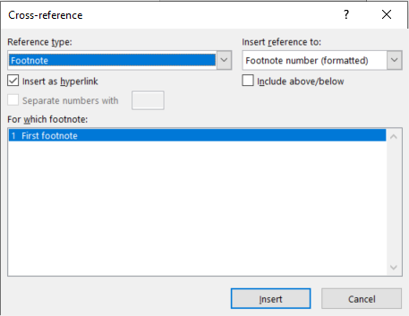

# Footnotes & Bibliography

Authors often need to add important information to the document that is not necessarily considered as the main content. Two examples are footnotes and bibliographical information.

> **Footnotes** allows authors to leave notes to the reader in a way that does not break the flow of the document.
> 
> **Bibliographical information** includes any sources of information that support the claims made in the document.

In the section we will learn how to insert and manage these two elements in MS Word.

## Footnotes and Endnotes

*Footnotes* appear at the **bottom** of the page while *Endnotes* come at the **end** of the document.

Once added, a number or symbol on the footnote or endnote matches up with a reference mark in the document.
    
## Adding footnotes or endnotes
   
1. Click where you want to reference to the footnote or endnote.
        
2. Go to the **References** tab, select **Insert Footnote** or **Insert Endnote**.
        
3. Enter what you want in the footnote or endnote.
        
4. Return to your place in the document by double-clicking the number or symbol at the beginning of the note.

### Mutliple references to the same footnote

Sometime you would like multiple locations in your text to refer to the same footnote.

Follow these steps:

1. Insert the first footnote as specified above.
2. Place your cursor where you would like the second footnote to appear.
3. Select **Cross-references** from the **References ribbon menu**.
4. Choose *Reference type: footnote* and *Insert reference to: Footnote number (formatted)*
5. Select your previous footnote and click on *Insert*.

## Citations & Bibliography

Citations are the souces of information that you used in your document.

Citations can be added in various formats, including APA, Chicago-style, IEEE, ISO 690, and MLA.
    
Once all citations are added as sources, a bibliography can be created automatically.
    
### Adding a Citation to Document Sources

Document sources is a list of all the citations available to a document. To add a new citation and source to a document:
    
1. Go to the **References** tab, in the **Citations & Bibliography** group, click the arrow next to **Style** and click the style that you want to use for the citation and source.
        
2. Click **Insert Citation** and then do one of the following:
        
3. To add the source information, click **Add New Source**, and then, in the **Create Source** dialog box, click the arrow next to **Type of Source**, and select the type of source you want to use (for example, a book section or a website).
            
4. Next, enter the details for the source. To add more information about a source, click the **Show All Bibliography Fields** check box.
                
5. To add a placeholder, so that you can create a citation and fill in the source information later, click **Add New Placeholder**. A question mark appears next to placeholder sources in Source Manager.
            
### Adding a Citation to the Page

Once a citation has been added as a source in the document, you can add it as a reference in a specific page:
    
1. Click at the end of the sentence or phrase that you want to cite, and then on the **References** tab, in the **Citations & Bibliography** group, click **Insert Citations**.
        
2. From the list of citations under **Insert Citation**, select the citation you want to use.
        
### Editing and Manage Sources
    
1. Go to **References Tab** and then select **Manage sources**
        
2. If you have many sources, you might need to search for a source that you cited in another document.
    
3. All sources you have referenced in other documents appear under **Master List**.
        
4. Citations of that document appear under **Current List**.
        
5. Find a specific source:
        
	- In the sorting box, sort by author, title, citation tag name, or year.
            
    - In the **Search** box, type the title or author for the source that you want to find.
            

## Creating a bibliography section

After adding sources, a bibliography can be created:
    
1. Put your cursor where you want the bibliography.
    
2. Go to **References** > **Bibliography**, and choose a format.

## References & Guides

> 📖 For this section of the notes please refer to the following resources:
> 
> -   [Insert footnotes and endnotes](https://support.microsoft.com/en-us/office/insert-footnotes-and-endnotes-61f3fb1a-4717-414c-9a8f-015a5f3ff4cb) by Microsoft
>     
> -   [Add citations in a Word document](https://support.microsoft.com/en-us/office/add-citations-in-a-word-document-ab9322bb-a8d3-47f4-80c8-63c06779f127) by Microsoft
>     
> -   [Create a bibliography, citations, and references](https://support.microsoft.com/en-us/office/create-a-bibliography-citations-and-references-17686589-4824-4940-9c69-342c289fa2a5) by Microsoft
>     
> -   (YouTube) [Creating a Bibliography in Word](https://www.youtube.com/watch?v=ty8ToryyWgA) [6:28 mins] by Everyday Office

For an excellent written resource with step by step instructions, see:

> [Microsoft Office Word: Tools for your Research Paper](https://apps.kennesaw.edu/files/pr_app_uni_cdoc/doc/Word_2016_PC_Tools_for_Your_Research_Paper.pdf) by Kennesaw State University

### For mac users 🍎

-   [Add footnotes and endnotes in Word on Mac and iOS](https://support.microsoft.com/en-us/office/add-footnotes-and-endnotes-in-word-on-mac-and-ios-a58d1685-94f6-43f5-ba26-aa15aa62c6ed)
    
-   [Refer to the same footnote or endnote more than once](https://support.microsoft.com/en-us/office/refer-to-the-same-footnote-or-endnote-more-than-once-9925ad08-2593-49ac-842b-c0f55b94e137)
    
-   [Add or change sources, citations, and bibliographies](https://support.microsoft.com/en-us/office/add-or-change-sources-citations-and-bibliographies-159264ec-0a8a-4e9e-acf7-21faa9c371c2)
    

## ⚠ Citing from the Internet

Not all sources found on the internet are a "web page".

> When citing work that was found online, ask yourself:
> 
> **What kind of digital document is this?**
> 
> -   Examples:
>     
>     -   Books;
>         
>     -   Article in a journal;
>         
>     -   Article in an online newspaper or digital magazine;
>         
> 
> If it is, you must cite it as a printed document and add the URL

**For help with citations**, see Concordia University's page: [**How to cite...**](https://library.concordia.ca/help/citing/index.php)

This resource includes guides and examples for most citations styles

## Citations Sources

There are many databases of academic sources available to John Abbott Students.

The following two sources are highly recommended:

1.  [OPALS: John Abbott's Library Catalog](https://jac.cegep.opalsinfo.net/bin/home)
    
2.  [Google Scholar](https://scholar.google.com/schhp?hl=en&as_sdt=0,5)
    

## Exercise Citations & Bibliography

Download the file _Internet of Things.zip_ available from Lea under week 4 and extract the content.

Using the file _Internet of Things.pdf_ as a reference, create a properly formatted MS Word document with footnotes and an automatic table of contents.

Follow the steps below:

**Document Style**

1.  Open the file `Internet of Things.docx`.
    
2.  Modify the default **_Normal_ style** so that:
    
    -   The font is _Arial_.
        
    -   The font size is 12 pt.
        
    -   The line spacing is set to double.
        
3.  Apply all necessary Styles so that it is similar to `Internet of Things.pdf` .
    
    -   Do not worry about the _References_ section as you will automatically create it later.
        
4.  Add any necessary footnotes
    

**Cover Page**

1.  Add a page break immediately below the Abstract section.
    
    -   The title author names and Abstract should be on the first page.
        
2.  Insert a _Table of Contents_ on the second page.
    
3.  Add a page break immediately below the _Table of Contents_ so that it is the only thing on the page.
    

**References & Bibliography**

1.  Using Word's _Citation_ feature, add all the references used in the original paper.
    
    -   Use IEEE citation style.
        
    -   Reference Type (if more accurate information is available feel free to use it).
        
        -   Reference # 1: Book Section
            
        -   Reference # 2,3,5,6: Website
            
        -   Reference # 4: Book
            
2.  Add all references using the _Citation_ feature.
    
3.  Insert an automatic Bibliography at the end of the document.
