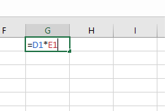

# Intro to Excel pt.2

## Cell References & Functions

### Cell References

-   There are two types of cell references: **relative** and **absolute**.
    
-   Relative and absolute references have different behaviors when copied and filled to other cells.
    
    -   Relative references **change** when a formula is copied to another cell.
        
    -   Absolute references, on the other hand, remain **constant** no matter where they are copied.
        
-   By default all cell references are **relative**. When copied, they change based on the relative position of rows and column.
    
    -   They are very useful if you want to repeat the same calculation across multiple rows or columns.
        
    -   To create a relative reference:
        
        -   Type the formula in one cell
            
        -   Use the fill handle in the bottom right corner of the cell and drag it over the cell you want to fill.

			
            
        -   Double click on the cells to check their formulas.
            
-   Absolute references have a `$` sign placed before the column, row, or both.
    
    -   $A$2: The column and the row do not change when copied.
        
    -   A$2: The row does not change when copied.
        
    -   $A2: The column does not change when copied.
        
        > A [shortcut](https://www.youtube.com/watch?v=SVPlRHK-XbI&t=3s) for creating absolute references.
        
-   To create an absolute reference:
    
    -   Type the formula in one cell adding `$` sign as needed
        
    -   Use the fill handle in the bottom right corner of the cell and drag it over the cell you want to fill.
        
-   To create cell references across different worksheets in the same workbook.
    
    -   Useful when you create a formula on one worksheet, that references a value from another.
        
    -   Add the name of the worksheet along before the cell address using the following format `Name_of_worksheet!Cell_Address!`
        
        > If a worksheet name contains a **space**, you'll need to include **single quotation marks (' ')**
        
    -   If you **rename** your worksheet, the cell reference will be updated automatically reflecting the new worksheet name.
        

### Functions

-   A **function** is a **predefined formula** that performs calculations using specific values in a particular order.
    
-   Excel has many predefined functions including **sum**, **average**, **count**, **maximum value**, and **minimum value** for a range of cells.
    
    -   To access the formula library, go to functions tab.
        
    -   Formulas are divided into categories like financial, text, date & time, etc..
        
-   To use functions, we need to understand the different **parts of a function** and how to create **arguments** to calculate values and cell references.
    
-   A function starts with an equal sign, followed by the name of the function, followed by one more arguments.
    
    -   Example: `=SUM(A1:A10)`
        
        -   `SUM` is the name of the function
            
        -   `A1:A10` is the single argument
            
    -   Arguments can refer to both individual cells (A10) or cell ranges (A1:A10).
        
    -   You can also send several arguments separated by commas
        
        -   Example: `=SUM(A1:A10, C1:C5, D1)`
            
-   The **AutoSum** command allows you to automatically insert the most common functions into your formula, including SUM, AVERAGE, COUNT, MAX, and MIN.
    
-   Example: SUM function.
    
    -   Select the cell where you want the sum to appear, in editing group of home function, select **AutoSum** command and choose SUM. Excel will automatically select a cell range that could be manually entered or modified.
        
    -   The **AutoSum** command can also be accessed from the formulas tab.
        
    -   **AutoSum** [shortcut](https://www.youtube.com/watch?v=4MxeY2m-hcI&t=41s) also exists
        
-   To enter a function manually,
    

> Excel **will not always tell you** if your formula contains an error, so it's up to you to check all of your formulas

-   To insert a function from the Function Library:
    
    -   Select the **cell** that will contain the function
        
    -   Select the **Formulas** tab to access the **Function Library**
        
    -   Select the **desired function** from the drop-down menu.
        
    -   The **Function Arguments** dialog box will appear. **Select** the desired cells.
        
-   To use the Insert Function command:
    
    -   Select the **cell** that will contain the function.
        
    -   Select the **Formulas** tab, then click the **Insert Function** command.
        
    -   Type a few **keywords** describing the calculation you want the function to perform, then click **Go**.
        
    -   Review the results to find the needed function.
        
    -   The **Function Arguments** dialog box will appear. **Select** the desired cells.
        

## Resources

-   [Relative and Absolute Cell References](https://edu.gcfglobal.org/en/excel/relative-and-absolute-cell-references/1/)
    
-   [Functions](https://edu.gcfglobal.org/en/excel/functions/1/)
    

## Exercises
    
1.  Download the `Wk5_practice.xlsx` excel file from lea and work on the spreadsheet.

