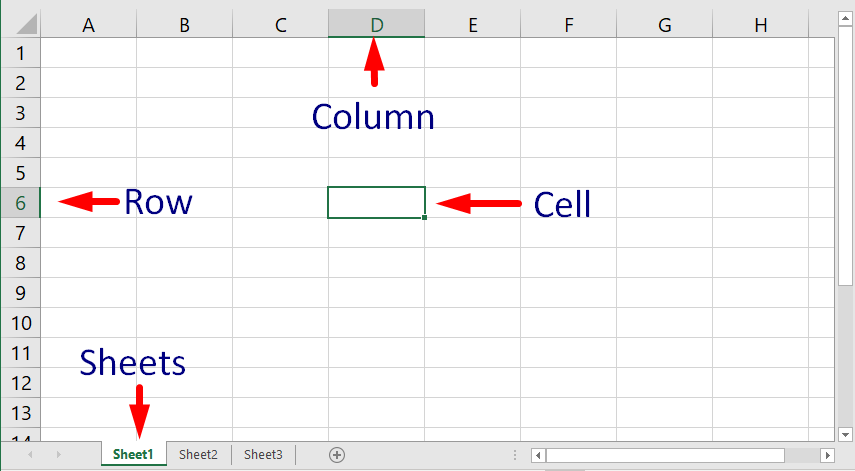

# Intro to Spreadsheets

Spreadsheets are a way of storing and processing data in a table format.

There are many examples of spreadsheet software such as:

-   Microsoft **Excel**
    
-   Google **Sheets**
    
-   Apple Numbers
    
-   LibreOffice **Calc**
    

A spreadsheet can have one or more sheets. Each sheet contains **multiple cells** and all the cells are **organized in columns and rows**.

In this course we will focus on using Excel, however, 90% of the functionality we will use is also available in Google Sheets.

## Intro to Excel

-   Similar to Microsoft word, exel has a ribbon (with adjusting options), tabs, groups, quick access toolbar, tell me or search, Microsoft account, zoom control, vertical and horizontal scroll bar, format painter, and backstage view.
    
-   However, there are features that are specific to spreadsheets, such as: the **formula bar**, **name box**, and **worksheet tabs**.
    
	1. The name box: The **Name box** displays the **location**, or **name**, of a **selected cell**.
	
	
   
	2. The formula bar: In the **formula bar**, you can enter or edit **data**, a formula, or a **function** that will appear in a specific cell.

	
        
	3.  Column: A **column** is a group of cells that runs from the top of the page to the bottom. In Excel, columns are identified by **letters**.

	4.  Row: A **row** is a group of cells that runs from the left of the page to the right. In Excel, rows are identified by **numbers**.
        
	5.  Cell: Each rectangle in a workbook is called a **cell**. A cell is the **intersection** of a row and a column. Simply click to **select** a cell.
        
    6.  Worksheets: Excel files are called **workbooks**. Each workbook holds one or more **worksheets**. Click the tabs to switch between them, or right-click for more options.
        
    7.  Worksheets view options: There are three ways to view a worksheet.
        
        -   **Normal view** is the default view for all worksheets in Excel.
            
        -   **Page Layout view** displays how your worksheets will appear when printed. You can also add headers and footers in this view.
            
        -   **Page Break view** allows you to change the location of page breaks, which is especially helpful when printing a lot of data from Excel.
            

## Formatting

Basic formatting can customize the **look and feel** of your workbook, allowing you to draw attention to specific sections and making your content easier to view and understand.

### Font size:

1.  Select the **cell(s)** you want to modify.
    
2.  On home tab, in Font group select the desired font size.
    
    > You can also use the **Increase Font** **Size** and **Decrease Font** **Size** commands or enter a **custom font size** using your keyboard.
    

### Fonts:

1.  Select the **cell(s)** you want to modify.
    
2.  On **Home** tab, in **Font** group select the desired font family.
    

### Font color:

1.  Select the **cell(s)** you want to modify.
    
2.  On **Home** tab, in **Font** group select the desired font color.
    
    > Select **More Colors** at the bottom of the menu to access additional color options.
    

### Bold, Italic, and Underline:

1.  Select the **cell(s)** you want to modify.
    
2.  Click the Bold (**B**), Italic (_I_), or Underline (U) command on the **Home** tab, in **Font** group.
    
    > You can also use **Ctrl+B** on shortcut to make selected text **bold**, **Ctrl+I** to apply **italics**, and **Ctrl+U** to apply an **underline**.
    

### Cell borders and fill colors

**Cell borders** and **fill colors** allow you to create clear and defined boundaries for different sections of your worksheet.

-   **To add a fill color:**
    
    1.  Select the **cell(s)** you want to modify.
        
    2.  On the **Home** tab, click the **drop-down arrow** next to the **Fill Color** command, in Font group, then select the **fill color** you want to use.
        
-   **To add a border:**
    
    1.  Select the **cell(s)** you want to modify.
        
    2.  On the **Home** tab, click the **drop-down arrow** next to the **Borders** command, in the Font group, then select the **border** **style** you want to use.
        
        > You can also draw borders and change the **line style** and **color** of borders with the **Draw Borders** tools at the bottom of the Borders drop-down menu.
        

### Cell styles

Similar to word styles, Excel's **predesigned cell styles** are a quick way to include formatting for different parts of your workbook, like **titles** and **headers**. **To apply a cell style:**

1.  Select the **cell(s)** you want to modify.
    
2.  Click the **Cell Styles** command on the **Home** tab, Styles group, then choose the **desired style** from the drop-down menu.

	
    
    > Applying a cell style will **replace** any existing cell formatting except for text alignment. You may not want to use cell styles if you've already added a lot of formatting to your workbook.
    

## Text alignment

-   Any text entered into your worksheet will be aligned to the bottom-left of a cell, while any numbers will be aligned to the bottom-right.
    
-   Changing the **alignment** of your cell content allows you to choose how the content is displayed in any cell, which can make your cell content easier to read.
    
-   In Home Tab > Alignment Group you have 6 alignment options ( 3 horizontal and 3 Vertical)
    

## Number formats

-   Number formats tell your spreadsheet exactly what type of data you're using, like percentages (%), currency ($), times, dates, and so on.
    
-   General format is the default number format of every cell in your spreadsheet.
    
-   Excel **automatically** applies a number formatting based on the way you enter data.
    
    -   Try entering January 1 and see what happens.
        
    -   Try entering January 1st and see what happens.
        
    
**To Apply a number format**:
    
Go to the **Home** tab, click the **Number Format** drop-down menu in the **Number** group, and select the desired format.
    
-   **Currency** number format, adds currency symbols ($) and displays two decimal places for any numerical values.
        
> If you select a cell with a number formatting, you can see the **actual value** of the cell in the **formula bar**. The spreadsheet will use this value for formulas and other calculations.

-   **Percentage** (%) format, displays values as percentages, like **20%** or **55%**. When you type a percent sign (%) after a number, the percentage number format will be be applied to that cell **automatically**.
	
	
        
> A percentage can also be written as a **decimal**. 15% is the same thing as 0.15, 7.5% is 0.075, 20% is 0.20, 55% is 0.55, and so on.
        
### Date format
        
-   If the date formatting isn't applied automatically, it means the spreadsheet did not understand the data you entered.
            
-   To add the current date to a cell, you can use the _*Ctrl+;_
            
-   When date is correctly formatted, the fill handle can be used to continue the dates through the column, so a different day appears in each cell.

		
-   Try entering the dates below into a spreadsheet and see if the date format is applied automatically:
            
	-   10/12
            
    -   October
                
    -   October 12
                
    -   October 2016
                
    -   10/12/2016
                
    -   October 12, 2016
                
    -   2016
                
    -   October 12th

            
To access other date formatting options, select the **Number Format** drop-down menu and choose **More Number Formats**. These are options to display the date differently, such as including the day of the week or omitting the year.
        
The **Format Cells** dialog box will appear. From here, you can choose the desired date formatting option.

        
Increase Decimal and Decrease Decimal: Allow you to control how many decimal places are displayed in a cell. These commands don't change the value of the cell; instead, they display the value to a set number of decimal places.

    

## Introduction to Formulas

Excel uses standard operators for formulas:

-   **plus sign** for addition (**+**)
    
-   **minus sign** for subtraction (**-**)
    
-   **asterisk** for multiplication (*)
    
-   **forward slash** for division (**/**)
    
-   **caret** (**^**) for exponents
    

**All formulas in Excel must begin with an equals sign (=). This is because the cell contains, or is equal to, the formula and the value it calculates.**

#### Cell references

-   Most of the time you will use **cell addresses** to create a formula.
    
-   This is known as making a **cell reference**.
    
-   Using cell references will ensure that your formulas are always accurate because you can change the value of referenced cells without having to rewrite the formula.

	
    
    -   When you press Enter, the formula calculates and displays the answer in cell A3
        
    -   If the values in the referenced cells change, the formula automatically recalculates:
        
    -   Instead of typing cell addresses manually, you can **point and click** the cells you want to include in your formula. This method can save a lot of time and effort when creating formulas.
        

#### Copying formulas with the fill handle

Formulas can also be **copied** to adjacent cells with the **fill** **handle**, which can save a lot of time and effort if you need to perform the **same calculation** multiple times in a worksheet. The **fill handle** is the small square at the bottom-right corner of the selected cell(s).

For this section of the notes please refer to the following [video](https://www.youtube.com/watch?v=xc14gFFyiTw&t=183s).

#### To edit a formula:

1.  Select the **cell** containing the formula you want to edit.
    
2.  Click the **formula bar** to edit the formula. You can also **double-click** the cell to view and edit the formula directly within the cell.
    

> If you change your mind, you can press the **Esc** key on your keyboard or click the **Cancel** command in the formula bar to avoid accidentally making changes to your formula.

To show all of the formulas in a spreadsheet, you can hold the **Ctrl** key and press `` ` `` (grave accent). The grave accent key is usually located in the top-left corner of the keyboard. You can press ``Ctrl+` `` again to switch back to the normal view.

## References

-   [Getting Started with Excel](https://edu.gcfglobal.org/en/excel/getting-started-with-excel/1/)
    
-   [Formatting Cells](https://edu.gcfglobal.org/en/excel/formatting-cells/1/)
    
-   [Understanding Number Formats](https://edu.gcfglobal.org/en/excel/understanding-number-formats/1/)
    
-   [Intro to Formulas](https://edu.gcfglobal.org/en/excel/intro-to-formulas/1/)
    

## Exercises

1.  Go to this link [Excel: Formatting Cells (gcfglobal.org)](https://edu.gcfglobal.org/en/excel/formatting-cells/1/), scroll down to the bottom of the page and complete the challenge.
    
2.  Go to this link [Excel: Understanding Number Formats (gcfglobal.org)](https://edu.gcfglobal.org/en/excel/understanding-number-formats/1/), scroll down to the bottom of the page and complete the challenge.
    
3.  Go to this link [Excel: Intro to Formulas (gcfglobal.org)](https://edu.gcfglobal.org/en/excel/intro-to-formulas/1/), scroll down to the bottom of the page and complete the challenge.