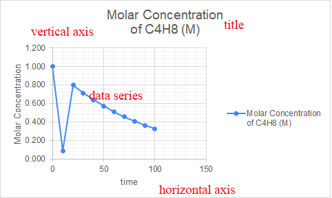
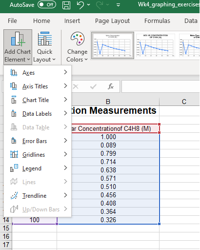
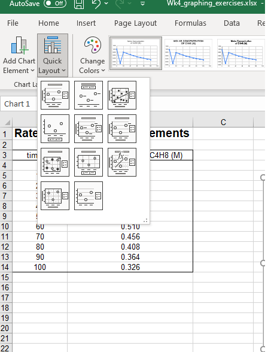
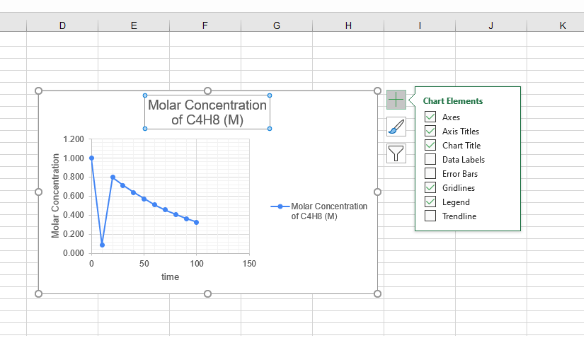

# Charts

### Chart types

There are several **types of charts** in Excel.

-   **Column**: Uses vertical bars to represent data. Used to compare information.
    
-   **Line**: Data points are connected with lines. Used to show trends in data (increasing or decreasing)
    
-   **Pie**: Each value is a slice of the pie. Used to compare proportions.
    
-   **Bar**: Similar to column chart, but horizontal rather than vertical.
    
-   **Area**: Similar to line charts except area under the line is filled.
    
-   **Surface**: Displays data in a 3D landscape. Best for large data sets. Allows you to see a variety of information at the same time.
    

### Chart parts

-   Chart Title: Describes what the chart is illustrating.
    
-   Horizontal Axis: x-axis
    
-   Vertical Axis: y-axis
    
-   Data Series: The data points in a chart.
    

**To insert a chart:**

1.  Select the **cells** you want to chart, including the **column titles** and **row labels**.
    
2.  From the **Insert** tab, choose the desired **Chart** type.
    
    > If you're not sure which type of chart to use, the **Recommended Charts** command will suggest several charts based on the source data.
    

### Chart elements

To add a chart element:

1.  Click the **Add Chart Element** command on the **Design** tab
    
2.  Choose the **desired element** from the drop-down menu.
    

**To edit a chart element:**

1.  Double-click the **placeholder** and begin typing. Example: chart title
    

Instead of adding elements individually, click the **Quick Layout** command, then choose the **desired layout** from the drop-down menu.

> Chart formatting shortcut buttons can also be used to quickly **add chart elements**, change the **chart style**, and **filter** chart data.

**To switch row and column data:**

1.  Select the **chart** you want to modify.
    
2.  From the **Design** tab, select the **Switch Row/Column** command.
    

**To move a chart:**

1.  Select the **chart** you want to move.
    
2.  Click the **Design** tab, then select the **Move Chart** command.
    
3.  The **Move Chart** dialog box will appear. Select the **desired location** for the chart.
    

**Keeping charts up to date:**

When you add more data to your spreadsheet, the chart may not include the new data.

To fix this, you can adjust the [**data range**](https://www.youtube.com/watch?v=a1osBWySSvk&t=2s).

1.  Click the chart, and it will highlight the data range in your spreadsheet.
    
2.  You can then click and drag the **handle** in the lower-right corner to change the data range.
    

### Chart Styles

Excel includes several **chart styles**.

To change the chart style, select the **desired style** from the **Chart styles** group.

**References**

-   [Charts](https://edu.gcfglobal.org/en/excel/charts/1/) from GCF Global
    
-   [Create a chart from start to finish](https://support.microsoft.com/en-us/office/create-a-chart-from-start-to-finish-0baf399e-dd61-4e18-8a73-b3fd5d5680c2) from Microsoft Support
    

**Exercises**

1.  Go to [GFC's lesson on charts](https://edu.gcfglobal.org/en/excel/charts/1/) and complete the challenge.
    
2.  Download the `graphing_lab.xlsx` file from Lea and complete it.