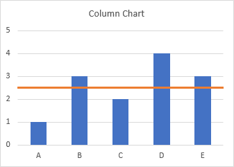
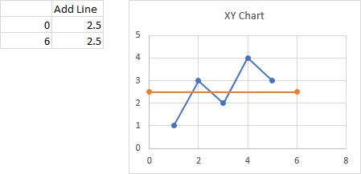
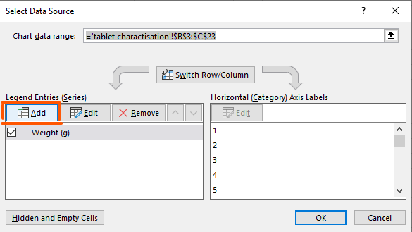
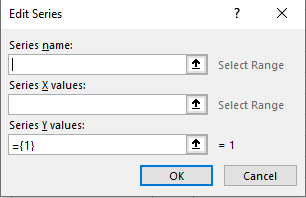
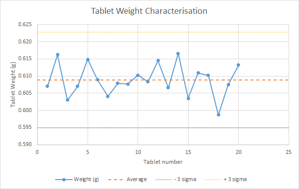

# Standard Deviation & Straight lines

## Standard Deviation

When measuring things we can often notice trends and patterns.

When naturally occurring measurements happens mostly around one central value, we can measure how spread out values are from this central "peak".

> Standard deviation is a measure of spread around a central value.
>
> In other words, it is a "distance" from an average value.

 

 

> In statistics we use the term **mean to say average**. <u>They are the same thing.</u>

 

### Standard Deviation in Excel

Excel has multiple build-in equation for calculating the standard deviation:

- **STDEV.P** - Standard Deviation on a Population
  - Used when every single element is included in your data
    - Eg. Stats Canada census since everyone has to do it.
- **STDEV.S** - Standard Deviation on a Sample
  - Used when you only have data for a sub-set of total data.
    - Eg. Taking a few tables from a production line.

> Most of the time we are working with Standard Deviation on a sample since we rarely have access to the entire data set.

Recommended [Video](https://www.youtube.com/embed/MRqtXL2WX2M)

## Adding horizontal lines to a chart

It can be helpful to add horizontal lines to charts in order to show limits or targets related to your data.

Lines can be inserted in your chart by adding a new series with two data points that share the same y-value.

**Follow the steps below:**

1. Setup a dummy table that contains two points (each with a x and y value).

2. Pick the y value in order to determine the "height" of the line you want to add.

3. Select x values that span the width of the graph (the beginning and the end of the x-axis).

   

   

   

4. In order to add the new series to the graph, right-click on the graph and choose:

   1. **Select Data** > **Add**

   2. Choose the name of your series from a cell or add it manually.

      

      

      

   3. Select the x and y values from the dummy table.

      

      

      

   4. Make any adjustments to your graph such as:

      1. Adjust the upper and lower bounds of your x-axis.
      2. Change the line thickness, color or style.
      3. Add a legend to identify what the line represents.

### References for adding horizontal lines

- [Add a Horizontal Line to an Excel Chart](https://peltiertech.com/add-horizontal-line-to-excel-chart/) by Peltier Tech
- [How to add a line in Excel graph (average line, benchmark, baseline, etc.)](https://www.ablebits.com/office-addins-blog/2018/09/12/add-line-excel-graph/) by Ablebits.com

## Exercises

Please download *std_Lab.xlsx* available in Lea.

1. Write formulas to find the average, standard deviation (S.D), maximum value and min value for tablet weight and thickness.

2. Calculate the acceptable weight variation from the average using the provided table "Acceptable criteria".

   To do this:

   * First check the weight and thickness values our tablets have and identify the corresponding acceptable variation coefficient for weight and thickness.
   * The acceptable upper limit is equal to the `average + acceptable variation coefficient * S.D.` for weight and thickness, respectively.

3. Using a graph of type "Scatter with straight lines and markers", plot the weight data for each tablet.

4. Plot the average and 3 standard deviations (-3σ and +3σ) found in step 1 as horizontal lines in your graph.
   - Use the dummy tables provided in the sheet to setup your horizontal lines.

5. Show the legend at the bottom of the graph.

6. Based on the value for the "acceptable weight variation from average" that you calculated in step 2, is this manufacturing process acceptable?

7. Repeat steps 2 to 5 with the thickness data.

 

The final graphs should look similar (not necessarily identical) to the one below:

