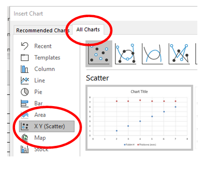
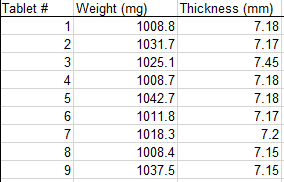
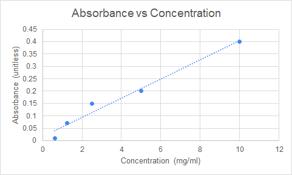
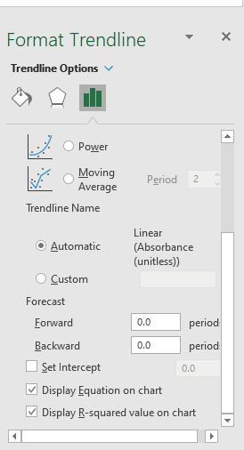

# Manipulating Graphs

This section will show how to manipulate your graph in order to create more interesting visualizations.

## Scatter Charts

When you are not sure of the type of chart that will best describe your data, a good starting point is a Scatter Chart.

> Scatter Charts offer the most flexibility when trying to identify patters or relationships.
>
> 👉 It is guaranteed to represent your data series as X and Y data (unlike the line chart which will sometimes add the data as separate data sets).

 

## Selecting non-adjacent data

Sometimes you might want to select data that is not side by side.

For example, in the table below, Tablet# and Thickness are not immediately beside each other.

 

**To select non-adjacent data:**

1. Select the data in the first column using the mouse (click and drag)
2. Press and hold down the key  `Ctrl` on your keyboard.
3. Select the second column using the mouse (click and drag)

 

## Trendlines

Trendlines can be added to a graph to easily visualize a trend in the data.

There are different types of trendlines that can be used. The most common is a linear trendline.

 

 

**To add a Trendline:**

1. Select a chart.

2. Select the `+` icon to the top right of the chart.

3. Select **Trendline**.

   > Excel displays the **Trendline** option only if you select a chart that has more than one data series without selecting a data series.

   

**To format a trendline:**

1. Select the trendline.
2. In the **Format Trendline** pane, select a **Trendline Option**. Formatting a trendline is a statistical way to measure data.
3. You can set a value in the **Forward** and **Backward** fields to project your data into the future.

**To add a moving average line:**

1. Select the trendline.

4. In the **Format Trendline** pane, under **Trendline Options**, select **Moving Average**. Specify the points if necessary.

   **Note:** The number of points in a moving average trendline equals the total number of points in the series less the number that you specify for the period.
   
   

## Equation of line

Once a trendline has been added, it is possible to extract the equation of that line and use those values to perform additional analysis on the data set.

 

The equation of a line is typically described as:

 

 

> If the **slope** and the **y-intercept** are known, then for any given X value we can find the respective Y value **and vice-versa**.

 

There are two ways of extracting the equations of a line from plotted data in Excel:

1. Display the equation on the graph and manually write down the Slope and Y-intercept constants.

2. Use the build-in `SLOPE` and `INTERCEPT` functions (preferred method)

 

- **Trendline equation** is a formula that finds a line that best fits the data points.
- **R-squared value** measures the trendline reliability - the nearer R2 is to 1, the better the trendline fits the data.

To display the trendline equation and R-squared value:

1. Right click on the trendline.

2. Choose format trendline.

3. Select **Display Equation on chart** and **Display R-squared value on chart**.

   
   
   

⚠ Excel trendline formulas should only be used with **XY (scatter) graphs** because only in this chart type both the y-axis and x-axis are plotted as numeric values.

💣 In **line charts, column, and bar graphs**, numeric values are plotted only on the y-axis. The x-axis is represented by a linear series (1, 2, 3,…) regardless of whether the axis labels are numbers or text. When you make a trendline in these charts, Excel uses those sequential x-values in the trendline formula.

 

### References 

* [Add a trend or moving average line to a chart](https://support.microsoft.com/en-us/office/add-a-trend-or-moving-average-line-to-a-chart-fa59f86c-5852-4b68-a6d4-901a745842ad)
* [Excel trendline types, equations and formulas](https://www.ablebits.com/office-addins-blog/2019/01/16/excel-trendline-types-equations-formulas/)

## Exercises

Please download *Trendlines.xlsx* available in Lea.

**Finding unknown concentrations.**

1. Using the sheet **Absorbance** create a Scatter chart and add a trendline to it.

2. Display the equation of the line on the Trendline.

3. Note slope and the y-intercept from the equation of the trendline.

4. Extract the slope and the y-intercept using the built in formulas and recreate the equation of a line.

5. Using this new equation, find what would be the concentrations associated with the following absorbances (add them to the existing table in the Excel sheet)

   

   

 

**Hardness vs Thickness**

1. Using the sheet **tables** create a Scatter chart of Hardness vs Thickness for the High compression force data.
2. Add a linear trendline to the data.
3. Display the equation of the line on the chart and visually extract the Slope and Y-intercept of the line.
4. Find what would be the hardness value of table with a thickness value of 5.91mm ?

