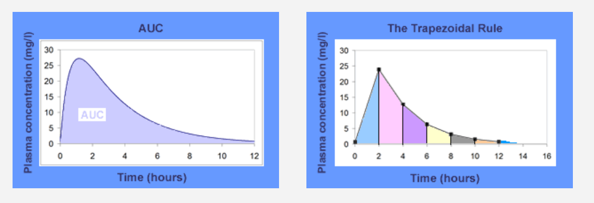
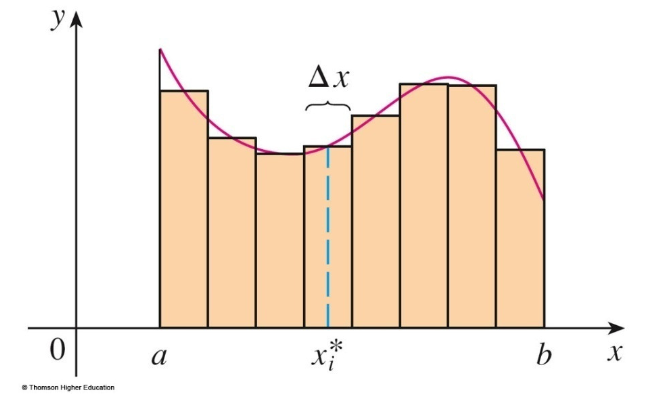
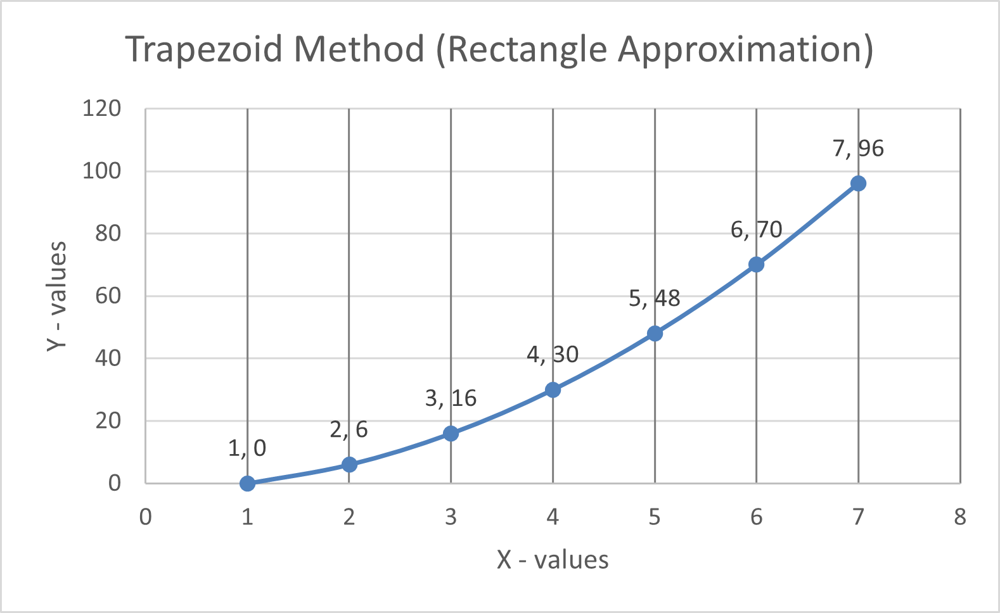
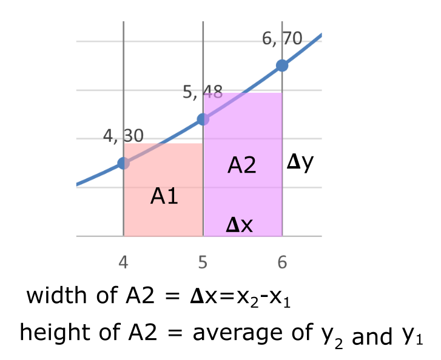

# Area Under a Curve (AUC)

There are many situations were the Area Under a Curve (AUC) can provide additional information about the data.

This happens because **the area under a curve has a mathematical relationship with the curve**. [See Introduction to Integration for more info.](https://www.mathsisfun.com/calculus/integration-introduction.html)

​

[_Area of the region bounded by its curve_](https://en.wikipedia.org/wiki/Integral)

​

> In the field of [pharmacokinetics](https://en.wikipedia.org/wiki/Pharmacokinetics), the **area under the curve** (**AUC**) describes the variation of a drug [concentration](https://en.wikipedia.org/wiki/Concentration) in [blood plasma](https://en.wikipedia.org/wiki/Blood_plasma) as a function of time.
> 
> In practice, the drug concentration is measured at certain points and the [trapezoidal rule](https://en.wikipedia.org/wiki/Trapezoidal_rule) (rectangular approximation) is used to estimate AUC.
> 
> _Wikipedia_ - [Area under the curve (pharmacokinetics)](https://en.wikipedia.org/wiki/Area_under_the_curve_%28pharmacokinetics%29)

This area under the curve is dependent on the rate of elimination of the drug from the body and the dose administered.

​

[_Theoretical vs calculated AUC with the trapezoidal rule_](https://en.wikipedia.org/wiki/Integral)

​

## AUC with Excel

We can use Excel to calculate the area under a curve. To do this we use the following approximation:

> 1.  Breakdown the area under a curve into small rectangles since the area of a rectangle is easy to calculate.
>     
> 2.  Sum the area of all the rectangles to get the total area.
>     

[_Area under a curve broken down into rectagles_](https://www.math.upenn.edu/~rimmer/math103/notes/complete/5pt1and3.pdf)

Consider the following data points plotted on a Scatter graph with smooth lines:

If we tried to approximate the area of a small section of the diagram we would have the following:

In Excel we will calculate 𝚫x and 𝚫y and then multiply them together to get the area of each rectangle.

**Exercises**

-   Please download the file `AreaUnderCurve.xlsx` in Teams under week 9.
    
-   Calculate the AUC of the data in the `Trapezoid` sheet.
    
-   Insert a line chart for the data in the `Rate of reaction` sheet.
    
-   Calculate the AUC of the data in the `Rate of reaction` sheet.