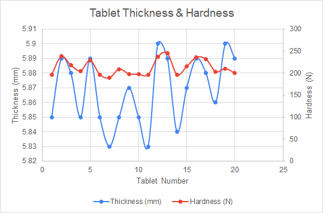

# Combo Charts

## Secondary Axis

A typical graph is made of one X axis and one Y axis.

However, sometimes different types of data can be collected on the same item.

If there is a relationship between these different types of measurements you might want to show it in the same graph.

For example, for a sample of manufactured tablets the thickness and hardness were measured.

One way to illustrate the thickness of each tablet would be to put Tablet # on the X-axis and Thickness on the Y-axis:

If we wanted to add a new measurement such as Hardness we would need a new axis since both the current X and Y axis are already being used.

In Excel we can add a Secondary axis to display two sets of data **as long as the data shares a common axis**

To achieve this:

1.  Select the chart
    
2.  Select **Select Data**
    
3.  Add series. Select the same x, new y, and the name of the series
    
4.  Right click on the new series and select **Format Data Series**
    
5.  Under **Series Options**, select **Secondary Axis**
    

Following the example above, we could add the Hardness measurements as a new axis on the right side of the chart.

This way we can see that there seems to be a relationship between tablet thickness and Hardness.

-   When there is a peak in thickness (blue line), there is **generally** a peak in hardness (red line).
    

### Combo Charts

**Secondary Axis can also be achieved in Excel with combo charts**:

1.  Select a chart.
    
2.  Select **Chart Design** > **Change Chart Type**.
    
3.  Select **Combo** > **Cluster Column - Line on Secondary Axis**.
    
4.  Select **Secondary Axis** for the data series you want to show.
    
5.  Select the drop-down arrow and choose **Line**.
    
6.  Select **OK**.
    

Video tutorial at this [link](https://support.microsoft.com/en-us/office/add-or-remove-a-secondary-axis-in-a-chart-in-excel-91da1e2f-5db1-41e9-8908-e1a2e14dd5a9).

## References

-   [Add or remove a secondary axis in a chart in Excel](https://support.microsoft.com/en-us/office/add-or-remove-a-secondary-axis-in-a-chart-in-excel-91da1e2f-5db1-41e9-8908-e1a2e14dd5a9)
    

## Exercises

Please download `Wk9_exercises.xlsx` available in Teams and complete the below exercises.

1.  Using tablets sheet
    
    1.  Let low Compression force cell cover cells A3 to D3.
        
    2.  Let high Compression force cell cover cells F3 to J3.
        
    3.  Apply 40% Accent 4 style on the cells on row 3.
        
    4.  Apply 40% Accent 4 style on the heading cells on row 4.

 

2.  Using the sheet **tablets** create a combo chart with the _High compression force_ **weight and thickness** data.
    
    1.  Both series should use a chart of type _stacked columns_.
        
    2.  Set the thickness as a secondary axis.
        
    3.  As usual, make sure to add axis titles, chart title, and legend if necessary.
        
    4.  Try to observe if there is any **relationship between tablet weight and thickness**.

       
 

3.  Using the sheet **tablets** create a combo chart with the _Low compression force_ **weight and thickness** data.
    
    1.  Both series should use a chart of type _Scatter with smooth lines and Markers_.
        
    2.  Set the thickness as a secondary axis.
        
    3.  As usual, make sure to add axis titles, chart title, and legend if necessary.
        
    4.  Do you observe the same type of relationship?

 

4.  Using tubes sheet.
    
    1.  Apply style 40% - Accent 3 on the heading cells labeled as Tube #, Concentration, and Absorbance.
        
    2.  Set the horizontal and vertical alignments of the heading cells to center.
        
    3.  Apply the proper number formatting on Concentration and Absorbance values such that only 2 digits are displayed after the decimal point
        
    4.  Create a combo chart that displays if there is a relationship between Concentration and Absorbance.
        
        -   Both series should use a chart of type _Scatter with Straight line and Markers_.
            
        -   Set the Absorbance as a secondary axis.
            
        -   As usual, make sure to add axis titles, chart title, and legend if necessary.
            
        -   Set the line color for Absorbance series to red.
            
        -   Set the marker for the Absorbance series to red triangles.
            
        -   Set the line color for Concentration series to orange.
            
        -   Set the marker for the Absorbance series to orange diamonds.